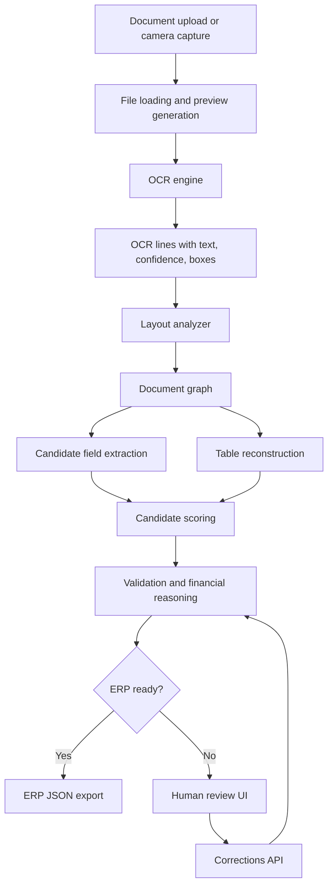

# Smart OCR-to-ERP Platform

Smart OCR-to-ERP Platform is a FastAPI-based document intelligence system for extracting, validating, reviewing, and exporting invoice data into ERP-ready JSON.

It is built for realistic invoices, receipts, delivery notes, and scanned commercial documents where layouts change, OCR is imperfect, and financial data must not be exported blindly.

## Why This Project Matters

Most OCR demos stop after reading text. This project goes further:

- it understands document layout;
- reconstructs invoice tables;
- scores extraction candidates;
- validates totals and line items;
- blocks risky ERP export;
- gives humans a visual review interface when confidence is low;
- stores corrections so recurring documents improve over time;
- includes benchmark tooling for dataset-level evaluation.

The central idea is simple: automate what is reliable, review what is uncertain, and never push weak data silently into ERP.

## Core Features

### Document Processing

- Supports PDF, scanned PDF, JPG, JPEG, PNG, TIFF, BMP.
- Uses PaddleOCR as the primary OCR engine.
- Supports Tesseract-style fallback paths when configured.
- Preserves OCR text, confidence, page number, bounding boxes, page size, and coordinate space.
- Rejects stale text-only OCR cache entries when geometry is required.

### Visual Document Understanding

- Detects logical regions such as:
  - supplier
  - customer
  - invoice metadata
  - product table
  - totals
  - taxes
  - payment
  - notes
  - footer
  - unknown blocks
- Builds a document graph from OCR lines, blocks, labels, and candidate values.
- Uses layout proximity, regex evidence, business rules, and consistency checks to score candidates.

### Invoice Field Extraction

Extracts and normalizes key ERP fields:

- supplier name
- customer name
- supplier tax ID
- invoice number
- invoice date
- due date
- purchase/order reference
- currency
- amount excluding tax
- tax amount
- total amount
- tax rate
- payment data
- line items
- validation status

Each rich extraction can include:

```json
{
  "value": "FAC-2026-0042",
  "confidence": 0.94,
  "bbox": {
    "x1": 820,
    "y1": 140,
    "x2": 1070,
    "y2": 170
  },
  "page": 1,
  "line_index": 4,
  "source": "candidate_scoring"
}
```

### Table and Line Item Recovery

- Detects table headers from English and French keywords.
- Infers table columns from x-position.
- Reconstructs rows from OCR boxes.
- Keeps row and cell evidence.
- Separates product lines from totals, shipping, footer, and payment rows.
- Marks uncertain fallback rows as review-needed instead of silently validating them.

### Human Review UI

The browser UI is designed as a lightweight document review workspace:

- upload or capture a document;
- preview the document page;
- toggle OCR boxes, layout blocks, field boxes, line-row boxes, and confidence labels;
- click detected regions to inspect evidence;
- edit extracted fields directly;
- edit, add, delete, or restore line items;
- save corrections;
- re-run validation;
- view ERP readiness before export.


### Validation and ERP Safety

The validation layer checks:

- required fields;
- OCR confidence;
- field confidence;
- invoice date format;
- total consistency;
- tax consistency;
- line item totals;
- duplicate or suspicious values;
- extraction quality gates;
- ERP export readiness.

Documents are classified into:

- `valid`: ready for ERP export;
- `needs_review`: extracted but requires human confirmation;
- `invalid`: blocked from export because required information is missing or inconsistent.

### Correction Workflow

Reviewers can:

- accept a candidate;
- edit a value manually;
- reject an incorrect candidate;
- correct supplier/customer/totals/line items;
- store evidence with original value, corrected value, bbox, page, source file, and timestamp.

The correction memory improves future scoring for recurring suppliers, customers, labels, layouts, and item descriptions.

### Benchmarking

The project includes multiple benchmark paths:

- fast smoke evaluation after code changes;
- medium and full evaluation modes;
- OCR/layout cache reuse;
- resumable checkpoints;
- fail-fast debugging;
- multi-dataset benchmark discovery;
- manual ground-truth benchmark support;
- HTML/Markdown/CSV/JSON reports.

Reports separate:

- extraction completeness: whether a field was found;
- true accuracy: whether the prediction matches ground truth.

OCR confidence is not true accuracy. A high OCR confidence score only means the OCR engine was confident about recognized text, not that the extracted business field is correct.

## Architecture



## Project Structure

```text
app/
  api/                 FastAPI routes
  core/                settings and schemas
  services/            OCR, layout, extraction, validation, ERP mapping
  static/              review UI assets
dataset/
  demo/                demo documents
  images/              sample images
  labels/              sample labels
docs/                  architecture, setup, benchmark, demo notes
scripts/               benchmark and analysis utilities
tests/                 regression and integration tests
run.py                 local application entry point
requirements.txt       Python dependencies
```

## Quick Start

### 1. Clone the repository

```powershell
git clone https://github.com/aymendhieb02/Smart-OCR-to-ERP-Platform.git
cd Smart-OCR-to-ERP-Platform
```

### 2. Create and activate a virtual environment

```powershell
python -m venv .venv
.\.venv\Scripts\Activate.ps1
```

If PowerShell blocks activation, run:

```powershell
Set-ExecutionPolicy -Scope Process -ExecutionPolicy Bypass
.\.venv\Scripts\Activate.ps1
```

### 3. Install dependencies

```powershell
python -m pip install --upgrade pip
pip install -r requirements.txt
```

### 4. Start the application

```powershell
python run.py
```

Open:

```text
http://127.0.0.1:8000/
```

Swagger/OpenAPI:

```text
http://127.0.0.1:8000/docs
```

## API Usage

Process a document:

```powershell
curl.exe -X POST "http://127.0.0.1:8000/process-invoice" -F "file=@invoice.png"
```

List demo documents:

```powershell
curl.exe "http://127.0.0.1:8000/demo-documents"
```

Validate corrections:

```text
POST /review/validate-corrections
```

The `/process-invoice` response preserves the original ERP-compatible fields and also returns richer review data:

- extracted text;
- detected fields;
- validation result;
- ERP JSON;
- ERP export payload;
- OCR blocks;
- layout blocks;
- field boxes;
- document preview;
- candidates;
- confidence details;
- debug traces.

## Benchmark Commands

Environment check:

```powershell
python scripts/benchmark_multi_datasets.py --check-env
```

Smoke benchmark:

```powershell
python scripts/evaluate_dataset.py --mode smoke
```

Medium benchmark:

```powershell
python scripts/evaluate_dataset.py --mode medium
```

Full benchmark with resume:

```powershell
python scripts/evaluate_dataset.py --mode full --resume
```

Multi-dataset sample:

```powershell
python scripts/benchmark_multi_datasets.py --datasets-root D:\Stage_udgroup\sources\datasets --limit-per-dataset 5 --seed 42
```

Manual ground-truth benchmark:

```powershell
python scripts/benchmark_manual_ground_truth.py
```

## Testing

Run the full test suite:

```powershell
python -m pytest -q
```

Compile-check Python files:

```powershell
python -m compileall -q app scripts tests
```

## Documentation

- [Architecture Overview](docs/architecture_overview.md)
- [Windows Setup](docs/setup_windows.md)
- [Benchmark Summary](docs/benchmark_summary.md)
- [Confidence Model](docs/confidence_model.md)
- [Final Demo Walkthrough](docs/final_demo_walkthrough.md)
- [Known Limitations](docs/limitations.md)

## Recommended Demo Flow

1. Start the app.
2. Open the review UI.
3. Load a clean demo invoice.
4. Show OCR boxes and layout blocks.
5. Click extracted fields and show evidence.
6. Edit a line item.
7. Save corrections.
8. Show recalculated validation.
9. Export ERP JSON only after the document is ready.
10. Load a noisy document and show that the system blocks unsafe export.

## Current Limitations

This project is suitable for demonstration, portfolio use, research, and controlled prototype evaluation. Before production deployment, it should be extended with:

- authentication and reviewer roles;
- database-backed correction storage;
- stronger audit logging;
- ERP-specific connector implementation;
- larger manually verified benchmark labels;
- deployment hardening;
- queue-based asynchronous processing for high-volume workloads.

## License

Add the license that matches your intended usage before distributing this project commercially.
