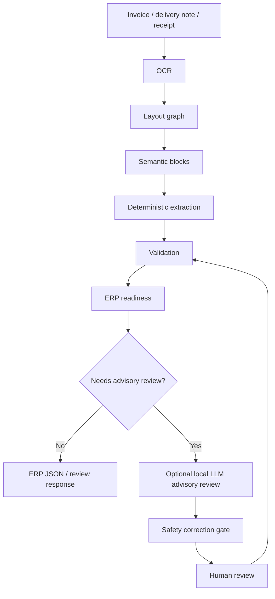
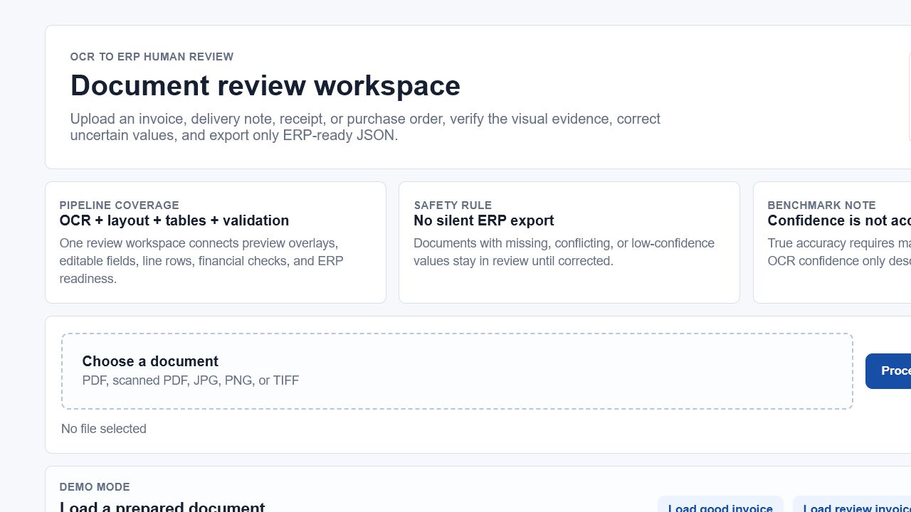

# Smart OCR-to-ERP Platform

Smart OCR-to-ERP Platform is a production-style FastAPI document intelligence system for extracting invoice data, validating it, reviewing uncertain values, and exporting ERP-ready JSON.

The platform is built around a deterministic OCR and extraction pipeline. It also includes an optional, evidence-grounded local LLM advisory layer for low-confidence review cases. The LLM does not replace OCR, deterministic extraction, validation, or human approval.

## Project Overview

Most OCR demos stop at text recognition. This project goes further:

- reads PDFs, scanned PDFs, and image invoices;
- preserves OCR text, confidence, bounding boxes, page size, and coordinate space;
- builds layout regions and a document graph;
- extracts invoice fields using deterministic candidate scoring;
- reconstructs invoice tables and line items;
- validates totals, VAT, row consistency, and required ERP fields;
- blocks unsafe ERP export;
- gives reviewers a visual UI with editable fields and line rows;
- stores correction evidence;
- provides deterministic, hybrid, and multi-dataset benchmark tooling.

The operating principle is simple: automate what is reliable, review what is uncertain, and never push weak data silently into ERP.

## Main Pipeline



## Safety Principles

- LLM support is optional and disabled by default.
- Advisory mode is the recommended deployment mode.
- The LLM never replaces OCR.
- The LLM receives structured evidence JSON, not raw uncontrolled OCR dumps.
- Proposals require evidence references.
- Unsupported corrections are rejected.
- Protected high-confidence deterministic values are not overwritten silently.
- Deterministic validation runs again after correction.
- Auto-apply remains disabled for the advisory release.
- ERP readiness remains deterministic.
- Human review stays in control.

## Core Capabilities

### OCR And Layout

- PaddleOCR primary OCR engine.
- Tesseract-compatible fallback paths when configured.
- OCR cache safety with bbox-aware cache validation.
- PDF/image preview generation.
- OCR boxes, layout blocks, field boxes, and row overlays.
- Logical block detection for supplier, customer, metadata, products, totals, payment, taxes, footer, notes, and unknown areas.

### Deterministic Extraction

The deterministic engine extracts and normalizes:

- supplier name;
- customer name;
- supplier tax ID;
- invoice number;
- invoice date;
- due date;
- purchase/order reference;
- currency;
- amount excluding tax;
- VAT/tax amount;
- total amount;
- tax rate;
- payment data;
- line items;
- validation status;
- ERP readiness.

Rich fields can include value, confidence, bbox, page, line index, and extraction source.

### Table And Line-Item Recovery

- Header detection with English/French aliases.
- Column inference from x-position.
- Row reconstruction from OCR boxes.
- Wrapped description handling.
- Row/cell evidence.
- Product rows separated from totals, shipping, footers, and bank/payment areas.
- Uncertain fallback rows marked for review.

### Review UI

The browser review workspace supports:

- document upload;
- camera capture;
- document preview;
- overlay toggles;
- clickable OCR/layout/field/row regions;
- editable extracted fields;
- editable/addable/deletable line items;
- correction saving;
- validation refresh;
- ERP JSON inspection.



### Hybrid LLM Advisory Layer

The hybrid layer is a fallback decision assistant, not a replacement extractor.

Current release policy:

- use `hybrid_prompt_v3`;
- invoke the LLM only when supplier or customer is missing;
- keep advisory mode;
- keep auto-apply disabled;
- keep OCR, dates, totals, tables, validation, and ERP readiness deterministic.

## Current Benchmark Status

Deterministic baseline:

- Invoice number: 100%
- Invoice date: 100%
- Supplier canonical: 70%
- Customer canonical: 100%
- Amount TTC: 76.92%
- Line-item presence: 60%
- Exact row count: 52%
- Within +/-1 rows: 68%

Prompt calibration:

- v1 valid JSON: 0%
- v2 valid JSON: 0%
- v3 valid JSON: 100%
- v4 valid JSON: 100%
- selected prompt: `hybrid_prompt_v3`

Important limitation:

Verified ground truth is incomplete, therefore hybrid accuracy improvement has not yet been proven. Hybrid reports intentionally block accuracy claims until complete human-verified labels exist.

OCR confidence is not true accuracy. A high OCR confidence score only means the OCR engine was confident about recognized text, not that the extracted business field is correct.

## Deployment Recommendation

Only invoke the LLM in advisory mode when supplier or customer is missing.

Keep deterministic:

- OCR
- invoice number
- dates
- totals
- VAT
- tables
- validation
- ERP readiness

Do not enable global auto-apply, table auto-correction, or financial auto-correction in this release.

## Project Structure

```text
app/
  api/                 FastAPI routes
  core/                settings and response schemas
  services/            OCR, layout, extraction, validation, ERP, hybrid advisory services
  static/              review UI assets
dataset/
  demo/                demo documents
  images/              sample images
  labels/              sample labels
  manual_ground_truth_benchmark/
docs/                  architecture, release, benchmark, setup, demo notes
scripts/               benchmark and analysis utilities
tests/                 regression and integration tests
run.py                 local application entry point
requirements.txt       Python dependencies
```

## Quick Start

```powershell
cd D:\Stage_udgroup\invoice-ocr-erp
python -m venv .venv
.\.venv\Scripts\Activate.ps1
python -m pip install --upgrade pip
python -m pip install -r requirements.txt
python run.py
```

Open:

```text
http://127.0.0.1:8000/
```

Swagger/OpenAPI:

```text
http://127.0.0.1:8000/docs
```

## API Usage

```powershell
curl.exe -X POST "http://127.0.0.1:8000/process-invoice" -F "file=@invoice.png"
curl.exe "http://127.0.0.1:8000/demo-documents"
```

Corrections are validated through:

```text
POST /review/validate-corrections
```

## Commands

Environment check:

```powershell
cd D:\Stage_udgroup\invoice-ocr-erp
.\.venv\Scripts\python.exe .\scripts\benchmark_hybrid_llm.py --check-env
```

Focused hybrid tests:

```powershell
.\.venv\Scripts\python.exe -m pytest tests/test_hybrid_llm_benchmark.py -q
```

Full tests:

```powershell
.\.venv\Scripts\python.exe -m pytest -q
```

Compile check:

```powershell
.\.venv\Scripts\python.exe -m compileall app scripts tests
```

Deterministic smoke benchmark:

```powershell
.\.venv\Scripts\python.exe .\scripts\evaluate_dataset.py --mode smoke
```

Deterministic benchmark with resume:

```powershell
.\.venv\Scripts\python.exe .\scripts\evaluate_dataset.py --mode full --resume
```

Multi-dataset smoke benchmark:

```powershell
.\.venv\Scripts\python.exe .\scripts\benchmark_multi_datasets.py --datasets-root D:\Stage_udgroup\sources\datasets --limit-per-dataset 5 --seed 42
```

Hybrid advisory benchmark:

```powershell
.\.venv\Scripts\python.exe .\scripts\benchmark_hybrid_llm.py --run-id hybrid_v3_advisory --mode advisory --max-documents 3 --prompt-versions hybrid_prompt_v3
```

Hybrid report-only mode:

```powershell
.\.venv\Scripts\python.exe .\scripts\benchmark_hybrid_llm.py --run-id hybrid_prompt_compression_3doc_02 --mode advisory --max-documents 3 --prompt-versions hybrid_prompt_v1,hybrid_prompt_v2,hybrid_prompt_v3,hybrid_prompt_v4 --report-only
```

Hybrid resume mode:

```powershell
.\.venv\Scripts\python.exe .\scripts\benchmark_hybrid_llm.py --run-id hybrid_v3_advisory --mode advisory --max-documents 10 --prompt-versions hybrid_prompt_v3 --resume
```

## Documentation

- [Hybrid LLM Architecture](docs/hybrid_llm_architecture.md)
- [Release v1.1 Hybrid Advisory](docs/releases/v1.1-hybrid-advisory.md)
- [Architecture Overview](docs/architecture_overview.md)
- [Windows Setup](docs/setup_windows.md)
- [Benchmark Summary](docs/benchmark_summary.md)
- [Confidence Model](docs/confidence_model.md)
- [Final Demo Walkthrough](docs/final_demo_walkthrough.md)
- [Known Limitations](docs/limitations.md)

## Recommended Demo Flow

1. Start the app.
2. Open the review UI.
3. Load a clean demo invoice.
4. Show OCR boxes and layout blocks.
5. Click extracted fields and show evidence.
6. Edit a line item.
7. Save corrections.
8. Show recalculated validation.
9. Export ERP JSON only after the document is ready.
10. Load a noisy document and show that unsafe export is blocked.
11. Explain that the LLM is advisory only and cannot bypass the deterministic safety gate.

## Current Limitations

- Hybrid accuracy improvement is not yet proven because verified labels are incomplete.
- Local Ollama inference can be slow on CPU-only machines.
- Stage-specific LLM latency is not fully instrumented in saved artifacts.
- Correction memory is rule-based, not ML training.
- Production deployment still needs authentication, reviewer roles, database-backed audit storage, and ERP-specific connectors.

## License

Add the license that matches your intended usage before distributing this project commercially.
