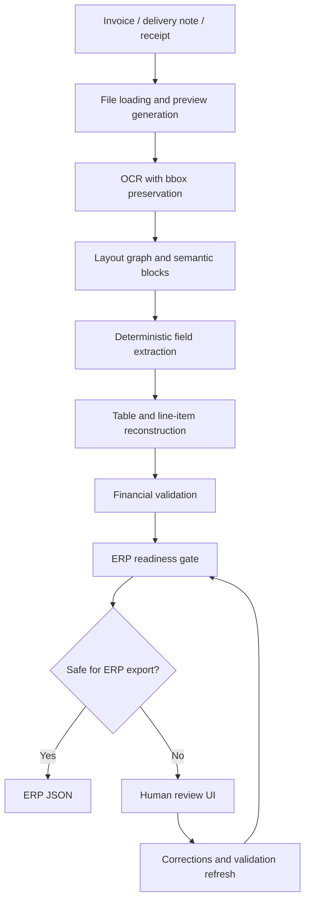
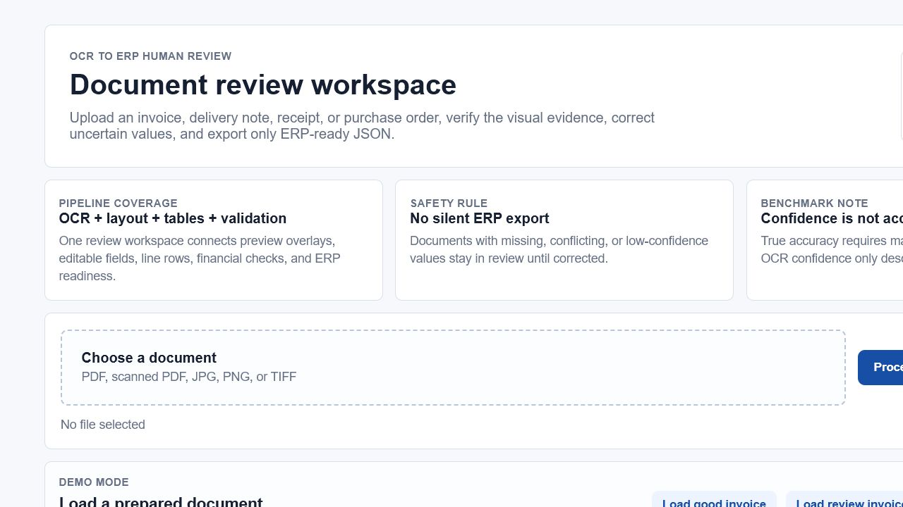

# Smart OCR-to-ERP Platform

Smart OCR-to-ERP Platform is a production-style FastAPI document intelligence system for extracting invoice data, validating it, reviewing uncertain values, and exporting ERP-ready JSON.

The production workflow is deterministic by default. It uses OCR, layout understanding, candidate scoring, financial validation, and human review instead of relying on a generative model for ERP decisions.

## Project Overview

Most OCR demos stop at text recognition. This project goes further:

- reads PDFs, scanned PDFs, and image invoices;
- preserves OCR text, confidence, bounding boxes, page size, and coordinate space;
- builds layout regions and a document graph;
- extracts invoice fields using deterministic candidate scoring;
- reconstructs invoice tables and line items;
- validates totals, VAT, row consistency, and required ERP fields;
- blocks unsafe ERP export;
- gives reviewers a visual UI with editable fields and line rows;
- stores correction evidence;
- provides deterministic benchmark tooling for datasets and regression testing.

The operating principle is simple: automate what is reliable, review what is uncertain, and never push weak data silently into ERP.

## Main Pipeline


```mermaid
flowchart TD
    A["Invoice / delivery note / receipt"] --> B["File loading and preview generation"]
    B --> C["OCR with bbox preservation"]
    C --> D["Layout graph and semantic blocks"]
    D --> E["Deterministic field extraction"]
    E --> F["Table and line-item reconstruction"]
    F --> G["Financial validation"]
    G --> H["ERP readiness gate"]
    H --> I{"Safe for ERP export?"}
    I -->|Yes| J["ERP JSON"]
    I -->|No| K["Human review UI"]
    K --> L["Corrections and validation refresh"]
    L --> H
```

## Why The Main System Is Deterministic

ERP extraction needs traceability more than creative reasoning. The production pipeline avoids generative correction in the normal request path because deterministic extraction is:

- faster and cheaper;
- easier to benchmark;
- easier to explain to a jury or auditor;
- safer for financial totals and VAT;
- independent of local model availability;
- fully tied to OCR/layout evidence and validation rules.

An experimental local LLM advisory module remains in the repository for research only. It is disabled by default, not part of the normal UI/demo flow, and cannot bypass deterministic validation.

## Core Capabilities

### OCR And Layout

- PaddleOCR primary OCR engine.
- Tesseract-compatible fallback paths when configured.
- OCR cache safety with bbox-aware cache validation.
- PDF/image preview generation.
- OCR boxes, layout blocks, field boxes, and row overlays.
- Logical block detection for supplier, customer, metadata, products, totals, payment, taxes, footer, notes, and unknown areas.

### Deterministic Extraction

The deterministic engine extracts and normalizes:

- supplier name;
- customer name;
- supplier tax ID;
- invoice number;
- invoice date;
- due date;
- purchase/order reference;
- currency;
- amount excluding tax;
- VAT/tax amount;
- total amount;
- tax rate;
- payment data;
- line items;
- validation status;
- ERP readiness.

Rich fields can include value, confidence, bbox, page, line index, and extraction source.

### Table And Line-Item Recovery

- Header detection with English/French aliases.
- Column inference from x-position.
- Row reconstruction from OCR boxes.
- Wrapped description handling.
- Row/cell evidence.
- Product rows separated from totals, shipping, footers, and bank/payment areas.
- Uncertain fallback rows marked for review.

### Review UI

The browser review workspace supports:

- document upload;
- camera capture;
- document preview;
- overlay toggles;
- clickable OCR/layout/field/row regions;
- editable extracted fields;
- editable/addable/deletable line items;
- correction saving;
- validation refresh;
- ERP JSON inspection.



## Current Deterministic Benchmark Status

- Invoice number: 100%
- Invoice date: 100%
- Supplier canonical: 70%
- Customer canonical: 100%
- Amount TTC: 76.92%
- Line-item presence: 60%
- Exact row count: 52%
- Within +/-1 rows: 68%

OCR confidence is not true accuracy. A high OCR confidence score only means the OCR engine was confident about recognized text, not that the extracted business field is correct.

## Project Structure

```text
app/
  api/                 FastAPI routes
  core/                settings and response schemas
  services/            OCR, layout, extraction, validation, ERP, review services
  static/              review UI assets
dataset/
  demo/                demo documents
  images/              sample images
  labels/              sample labels
  manual_ground_truth_benchmark/
docs/                  architecture, benchmark, setup, demo notes
scripts/               benchmark and analysis utilities
tests/                 regression and integration tests
run.py                 local application entry point
requirements.txt       Python dependencies
```

## Quick Start

```powershell
cd D:\Stage_udgroup\invoice-ocr-erp
python -m venv .venv
.\.venv\Scripts\Activate.ps1
python -m pip install --upgrade pip
python -m pip install -r requirements.txt
python run.py
```

Open:

```text
http://127.0.0.1:8000/
```

Swagger/OpenAPI:

```text
http://127.0.0.1:8000/docs
```

## API Usage

```powershell
curl.exe -X POST "http://127.0.0.1:8000/process-invoice" -F "file=@invoice.png"
curl.exe "http://127.0.0.1:8000/demo-documents"
```

Corrections are validated through:

```text
POST /review/validate-corrections
```

## Useful Commands

Full tests:

```powershell
.\.venv\Scripts\python.exe -m pytest -q
```

Compile check:

```powershell
.\.venv\Scripts\python.exe -m compileall app scripts tests
```

Deterministic smoke benchmark:

```powershell
.\.venv\Scripts\python.exe .\scripts\evaluate_dataset.py --mode smoke
```

Deterministic benchmark with resume:

```powershell
.\.venv\Scripts\python.exe .\scripts\evaluate_dataset.py --mode full --resume
```

Multi-dataset smoke benchmark:

```powershell
.\.venv\Scripts\python.exe .\scripts\benchmark_multi_datasets.py --datasets-root D:\Stage_udgroup\sources\datasets --limit-per-dataset 5 --seed 42
```

## Optional Research Archive

The repository still contains an experimental local LLM advisory layer and related benchmark scripts. They are kept for research comparison, not production use.

To enable it manually, set:

```powershell
$env:INVOICE_OCR_ENABLE_LLM_RESOLVER="true"
```

Recommended production/demo setting:

```powershell
$env:INVOICE_OCR_ENABLE_LLM_RESOLVER="false"
```

Do not use the advisory module to auto-apply ERP corrections. The deterministic gate and human review remain the source of truth.

## Documentation

- [Architecture Overview](docs/architecture_overview.md)
- [Windows Setup](docs/setup_windows.md)
- [Benchmark Summary](docs/benchmark_summary.md)
- [Confidence Model](docs/confidence_model.md)
- [Final Demo Walkthrough](docs/final_demo_walkthrough.md)
- [Known Limitations](docs/limitations.md)

## Recommended Demo Flow

1. Start the app.
2. Open the review UI.
3. Load a clean demo invoice.
4. Show OCR boxes and layout blocks.
5. Click extracted fields and show evidence.
6. Edit a line item.
7. Save corrections.
8. Show recalculated validation.
9. Export ERP JSON only after the document is ready.
10. Load a noisy document and show that unsafe export is blocked.
11. Explain that the system is deterministic, auditable, and designed for ERP safety.

## Current Limitations

- Some supplier/customer names still require human review on unusual layouts.
- Table reconstruction can require review on heavily merged OCR rows or low-quality scans.
- Correction memory is rule-based, not ML training.
- Production deployment still needs authentication, reviewer roles, database-backed audit storage, and ERP-specific connectors.

## License

Add the license that matches your intended usage before distributing this project commercially.
