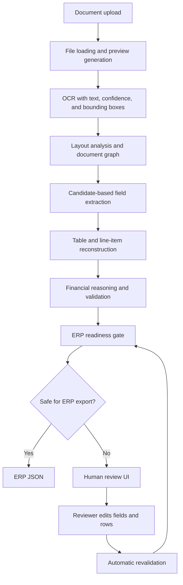

# Smart OCR-to-ERP Platform

Smart OCR-to-ERP Platform is a production-style document intelligence system for turning invoices and business documents into validated ERP-ready JSON.

It combines OCR, layout understanding, deterministic field extraction, table reconstruction, financial validation, and a human review workspace. The goal is not just to read text from a document, but to decide whether the extracted business data is reliable enough to export into an ERP system.

## Key Features

- Upload invoices, receipts, delivery notes, purchase orders, PDFs, scanned PDFs, and image files.
- Extract supplier, customer, invoice metadata, totals, taxes, currency, and line items.
- Preserve OCR evidence with bounding boxes, confidence scores, page numbers, and coordinate metadata.
- Detect logical document regions such as supplier, customer, metadata, products, totals, taxes, payment, notes, and footer.
- Reconstruct editable product/service line items from OCR layout.
- Validate HT/subtotal, VAT, TTC, tax rate, row totals, and ERP-required fields.
- Block unsafe ERP export when values are missing, inconsistent, or require review.
- Provide a clean browser review UI with document preview, overlays, editable fields, editable line items, correction saving, and automatic revalidation.
- Export deterministic ERP JSON for downstream integration.
- Support benchmarking, diagnostics, timing reports, and regression tests.

## Product Workflow


```mermaid
flowchart TD
    A["Document upload"] --> B["File loading and preview generation"]
    B --> C["OCR with text, confidence, and bounding boxes"]
    C --> D["Layout analysis and document graph"]
    D --> E["Candidate-based field extraction"]
    E --> F["Table and line-item reconstruction"]
    F --> G["Financial reasoning and validation"]
    G --> H["ERP readiness gate"]
    H --> I{"Safe for ERP export?"}
    I -->|Yes| J["ERP JSON"]
    I -->|No| K["Human review UI"]
    K --> L["Reviewer edits fields and rows"]
    L --> M["Automatic revalidation"]
    M --> H
```

## Why It Is Deterministic

ERP data must be traceable. The main extraction path is deterministic so every result can be explained by OCR evidence, layout position, candidate scoring, and validation rules.

This keeps the system:

- auditable;
- easier to test;
- safer for financial fields;
- cheaper to run;
- independent of external LLM services;
- suitable for production review workflows.

## Main Modules

```text
app/
  main.py                         FastAPI application and routes
  core/
    config.py                     Environment settings
    schemas.py                    API and ERP response models
  services/
    ocr_engine.py                 OCR execution and normalization
    pipeline_runner.py            Main processing orchestration
    document_layout.py            Layout and table reconstruction
    field_extractor.py            Candidate-based field extraction
    financial_reasoner.py         Totals and arithmetic reasoning
    validator.py                  ERP validation rules
    erp_mapper.py                 ERP JSON/export mapping
    correction_store.py           Review correction and revalidation flow
  static/
    index.html                    Review UI shell
    app.js                        Review UI behavior
    styles.css                    Review UI styling
scripts/                          Benchmarks, audits, diagnostics, utilities
tests/                            Regression and service tests
docs/                             Architecture, audit, and release notes
```

## Requirements

Recommended:

- Python 3.11+
- Windows, Linux, or macOS
- PaddleOCR-compatible environment
- Optional Tesseract installation for fallback OCR paths

Core Python dependencies are listed in:

```text
requirements.txt
```

Optional dependency sets:

```text
requirements-dev.txt       tests, reports, benchmark tooling
requirements-ml.txt        optional Table Transformer / layout model experiments
```

## Local Setup

From the project root:

```powershell
python -m venv .venv
.venv\Scripts\activate
python -m pip install --upgrade pip
python -m pip install -r requirements.txt
```

For development and tests:

```powershell
python -m pip install -r requirements-dev.txt
```

For optional ML model experiments only:

```powershell
python -m pip install -r requirements-ml.txt
```

Copy the environment template if needed:

```powershell
copy .env.example .env
```

## Run The App

```powershell
python run.py
```

Then open:

```text
http://127.0.0.1:8000/
```

Useful endpoints:

```text
GET  /health
POST /process-invoice
POST /review/validate-corrections
```

Swagger is available at:

```text
http://127.0.0.1:8000/docs
```

## Review UI

The browser UI is the recommended demo surface. It lets the reviewer:

- upload a document;
- see the document preview;
- inspect OCR/layout/field overlays;
- edit detected ERP fields;
- edit line items directly in the table;
- see a live line-items total;
- save corrections;
- re-run validation without re-running OCR;
- copy ERP JSON after the document is safe.

The UI and Swagger use the same backend API, so a successful UI demo also proves the API flow.

## ERP Safety Gate

The system separates extraction from export. A value can be detected but still withheld from ERP export if it fails validation.

Typical reasons for review:

- missing required fields;
- HT + VAT does not match TTC;
- line totals do not match invoice totals;
- suspicious tax rate;
- low confidence OCR or extraction evidence;
- incomplete line item rows;
- conflicting candidate values.

Only validated corrected data should be exported.

## Docker

A Dockerfile is included for deployment packaging.

Build:

```powershell
docker build -t smart-ocr-erp .
```

Run:

```powershell
docker run --rm -p 8000:8000 smart-ocr-erp
```

Then open:

```text
http://127.0.0.1:8000/
```

Note: OCR model downloads and optional native dependencies may require extra system setup depending on the target environment.

## Testing

Compile check:

```powershell
python -m compileall app scripts tests
```

Focused test example:

```powershell
python -m pytest tests/test_field_consistency.py -q
```

Full suite:

```powershell
python -m pytest -q
```

Some experimental tests may require optional ML dependencies from `requirements-ml.txt`.

## Benchmarking And Diagnostics

The repository includes scripts for dataset evaluation, performance timing, table diagnostics, and extraction quality analysis.

Common report locations:

```text
dataset/reports/
outputs/
```

Generated benchmark outputs, caches, model weights, and local runtime artifacts should not be committed.

## Configuration

Settings are read from environment variables through `app/core/config.py`.

Use `.env.example` as the starting point for local deployment configuration.

Optional model integrations such as Table Transformer and layout model experiments are gated by configuration and are not required for the core deterministic OCR-to-ERP workflow.

## Delivery Notes

This final product version is designed around a clean deterministic workflow:

```text
OCR -> layout -> extraction -> table reconstruction -> validation -> review -> ERP JSON
```

The archived previous README is kept at:

```text
docs/archive/README_before_final_product.md
```

Use that file only as historical documentation. The root `README.md` describes the current final product.
