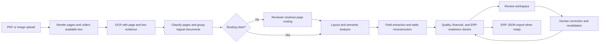

# Smart OCR-to-ERP Platform

An OCR-assisted document review workspace for turning invoices and related trade documents into structured data that can be checked before ERP export. The system combines OCR evidence, document/page classification, deterministic extraction, line-item reconstruction, financial validation, and human review.

The key product rule is **review before export**: extracted data is not treated as correct merely because OCR returned a value. Missing, conflicting, low-confidence, or financially inconsistent data is surfaced for review. OCR confidence is not true accuracy; measured accuracy requires comparison with manually verified ground truth.

## How it works


```mermaid
flowchart LR
    A[PDF or image upload] --> B[Render pages and collect available text]
    B --> C[OCR with page and box evidence]
    C --> D[Classify pages and group logical documents]
    D --> E{Routing clear?}
    E -->|No| F[Reviewer resolves page routing]
    F --> G[Layout and semantic analysis]
    E -->|Yes| G
    G --> H[Field extraction and table reconstruction]
    H --> I[Quality, financial, and ERP-readiness checks]
    I --> J[Review workspace]
    J --> K[Human correction and revalidation]
    K --> I
    I --> L[ERP JSON export when ready]
```

The browser workspace supports multi-page dossiers: physical-page navigation is synchronized with logical-document tabs, while fields remain scoped to their logical document and page evidence/overlays remain scoped to the selected physical page.

## Quick start

Requirements: Python 3.11 or newer. PaddleOCR is the primary OCR engine; Tesseract is an optional fallback and must be installed separately if you want that fallback available.

```powershell
python -m venv .venv
.venv\Scripts\Activate.ps1
python -m pip install --upgrade pip
python -m pip install -r requirements.txt
python run.py
```

Open [http://127.0.0.1:8000/](http://127.0.0.1:8000/). API documentation is at [http://127.0.0.1:8000/docs](http://127.0.0.1:8000/docs).

For development and tests, install `requirements-dev.txt`. Optional layout/table-model experiments are described by `requirements-ml.txt`; they are not required for the default workflow. See [Windows setup](docs/setup_windows.md) and [.env.example](.env.example) for configuration.

## API surface

The main workflows are:

- `POST /process-dossier` — process a multi-page dossier and return logical documents, extracted fields, line items, evidence, validation, and review state.
- `POST /process-invoice` — process a single invoice/document.
- `POST /resolve-dossier-routing` — continue a dossier after ambiguous page routing is reviewed.
- `POST /review/reconcile-dossier` and `POST /review/validate-corrections` — apply/revalidate human review changes.
- `POST /export-erp-json` and `POST /export-simple-dossier-json` — produce structured exports.
- `GET /health` — health check.

Demo-document, correction, and dataset-evaluation routes are also available; the running API’s Swagger page is the authoritative request/response reference.

## Project map

```text
app/                 FastAPI application, services, schemas, and review UI
scripts/             Dataset evaluation, benchmarks, and diagnostics
tests/               API, service, UI-contract, and regression tests
docs/                Architecture, setup, limitations, and benchmark guides
dataset/             Synthetic/public evaluation assets and report structure
```

See [Architecture](docs/architecture_overview.md) for the processing flow and module responsibilities, and [Documentation index](docs/README.md) for the rest of the project guides.

## Tests and evaluation

```powershell
python -m pip install -r requirements-dev.txt
python -m pytest
```

The benchmark guides explain smoke/medium/full evaluation and multi-dataset reporting. Run them only with datasets you are authorized to process. Benchmark completeness, model confidence, and human-verified accuracy are different measures; do not present confidence or unverified labels as accuracy.

## Data handling

Client documents, OCR output, and human-verified client labels are private working data and must stay local. Do not commit PDFs, raw OCR evidence, generated predictions containing source text, or client ground truth. The repository ignores `/local_data/`, `/dossier_ground_truth/`, and `/dataset/dossier_ground_truth/`; verify `git status` before committing. Keep only synthetic or appropriately anonymized fixtures in tests and documentation.

The app accepts multilingual source documents, including French, English, and Arabic text. Source-text Unicode is preserved as data; Arabic UI localization and right-to-left layout are not implemented. Review original page images when verifying OCR.

## Deployment boundary

The root `Dockerfile` is a general repository build, not a promise of a hardened, multi-user production service. Before exposing it to untrusted users, add deployment-specific authentication/authorization, storage and retention controls, resource limits, observability, and security review. The application does not include a live ERP connector; JSON export is an integration boundary. See [limitations](docs/limitations.md) for the current product boundary. Version-specific deployment audits should be published separately only after checking that they contain no local paths, credentials, or client data.
