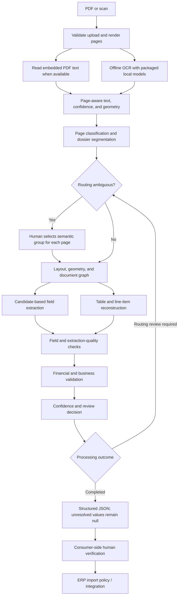

# Smart OCR-to-ERP Platform

**An evidence-first OCR pipeline that turns commercial-document dossiers into structured data for human review and downstream ERP integration.**

[](https://www.python.org/)
[](https://fastapi.tiangolo.com/)
[](#docker-deployment)
[](#docker-deployment)
[](https://github.com/aymendhieb02/Smart-OCR-to-ERP-Platform/tree/v3.3)

This project addresses a practical gap between OCR text and usable business records: recognizing characters is not enough. The system groups pages into semantic documents, extracts fields and table rows with evidence, checks business/financial consistency, and makes uncertainty visible before ERP use.

> **Release boundary:** v3.3 is a verified, CPU-only production API image. Its release archive is not stored in this repository, and no public container-registry URL is published. The checked-in source and root `Dockerfile` are a separate development build; they do not recreate the v3.3 public API/image exactly.

## Why this is more than OCR

Plain OCR returns text. This pipeline also retains page and geometry context, classifies dossier pages, proposes structured fields and line items, and checks extraction/financial consistency. Missing or uncertain values remain `null`; ambiguous page assignments request routing review rather than being guessed to make an export look complete.

## Production pipeline


```mermaid
flowchart TD
    A[PDF or scan] --> B[Validate upload and render pages]
    B --> C[Read embedded PDF text when available]
    B --> D[Offline OCR with packaged local models]
    C --> E[Page-aware text, confidence, and geometry]
    D --> E
    E --> F[Page classification and dossier segmentation]
    F --> G{Routing ambiguous?}
    G -->|Yes| H[Human selects semantic group for each page]
    H --> I[Layout, geometry, and document graph]
    G -->|No| I
    I --> J[Candidate-based field extraction]
    I --> K[Table and line-item reconstruction]
    J --> L[Field and extraction-quality checks]
    K --> L
    L --> M[Financial and business validation]
    M --> N[Confidence and review decision]
    N --> O{Processing outcome}
    O -->|Routing review required| G
    O -->|Completed| P[Structured JSON; unresolved values remain null]
    P --> Q[Consumer-side human verification]
    Q --> R[ERP import policy / integration]
```

The editable diagram source is [`docs/architecture/README_PIPELINE.mmd`](docs/architecture/README_PIPELINE.mmd). A rendered SVG is not checked in; GitHub renders the Mermaid diagram directly.

## Architecture

The pipeline has four practical boundaries:

1. **Input and evidence** — validate PDF/image uploads, render physical pages, read embedded PDF text if present, and produce page-aware OCR text/geometry.
2. **Document understanding** — classify pages, group physical pages into logical documents, analyze layout, score field candidates, and reconstruct tables.
3. **Trust checks** — validate required fields, rows, totals and financial relationships; unresolved/conflicting evidence remains reviewable.
4. **Integration** — the production v1 API returns a stable, reduced JSON contract; a consumer maps reviewed business values into its ERP. There is no live ERP connector in this repository.

Production package details and source/deployment distinctions are in [Architecture](docs/architecture_overview.md) and the [README audit](docs/README_AUDIT.md).

## Production API

The v3.3 production image documents exactly these public v1 routes:

| Method | Route | Purpose |
| --- | --- | --- |
| `GET` | `/api/v1/health` | Health check; does not initialize OCR. |
| `POST` | `/api/v1/dossiers/process` | Process one PDF/image upload; may return completed data or routing choices. |
| `POST` | `/api/v1/dossiers/resolve-routing` | Resolve ambiguous physical-page assignments using a short-lived routing session. |

The production OpenAPI page is at `/docs`. Other source backend routes are legacy/compatibility routes and are hidden from the production OpenAPI contract. See the [Production API v1 guide](docs/production_api_v1.md) for upload limits, routing, response semantics, and security boundaries.

**Source checkout caveat:** `python run.py` runs the checked-in development app, whose router is not the same as the versioned production facade. Use the v3.3 image for the documented public v1 contract; do not integrate against the legacy development routes.

## Synthetic response example

All values below are invented. The downloadable [JSON example](docs/examples/production-response.synthetic.json) is intentionally abbreviated; the full production schema includes additional nullable fields.

```json
{
  "api_version": "1.0",
  "status": "completed",
  "data": {
    "page1": {
      "seller": "Example Supplier",
      "invoice_number": "INV-2026-001",
      "currency": "EUR",
      "total": "125.00",
      "line_items": [
        {
          "description": "Product A",
          "quantity": 2.0,
          "unit": "EA",
          "unit_price": "62.50",
          "line_total": "125.00"
        }
      ]
    },
    "page2": null,
    "page3": null
  }
}
```

## Evidence-first extraction and human review

**Uncertain value ≠ guessed value.** The system uses OCR text with page provenance and bounding-box geometry to support extraction and review. **OCR confidence is not true accuracy.** Confidence is an engine signal, not a probability that the business value is correct. Financial consistency and required-field checks add further guardrails; they do not replace human verification.

When evidence is absent or conflicting, the public contract uses `null` for unresolved fields and the dossier workflow can request routing review. `status: "completed"` means processing finished—it does not certify every field as accurate or ERP-approved. The public v1 response deliberately does not expose raw OCR text, evidence boxes, or internal review objects. Human-review workflows available in the development UI are not packaged as a browser UI in the backend-only production image.

## Supported and tested scope

The verified production dossier groups are:

- `page1`: producer invoice;
- `page2`: RUSPINA invoice;
- `page3`: customs declaration.

The v3.3 release passed exact public-response parity against v3.2 on six canonical local dossiers. That is a regression/parity result, **not** a field-accuracy percentage or a claim that every invoice layout is supported. The API accepts PDF and common raster-image formats, but file-format acceptance is not a promise of extraction quality for every document family.

The production runtime uses PaddleOCR 3.7.0 with PaddlePaddle 3.3.1 CPU and packaged PP-OCRv4 mobile detector/English recognizer models. Tesseract 5.3.0 with `eng` and `fra` language data is present for fallback. Unicode is preserved in the API contract, but Arabic recognition quality is not established by the v3.3 release tests; Arabic UI and right-to-left presentation are not implemented.

## Current release — v3.3

The Git tag [`v3.3`](https://github.com/aymendhieb02/Smart-OCR-to-ERP-Platform/tree/v3.3) is the current source release. The separately built production image has these verified characteristics:

| Item | v3.3 |
| --- | --- |
| Image tag | `ocr-ruspina:3.3` (local Docker tag) |
| Platform | Linux/amd64, CPU-only |
| Image size | 1,834,186,378 bytes; 11 layers |
| Runtime user | `appuser`, UID 10001 (non-root) |
| Server | Uvicorn, one worker; port 8000 |
| OCR | Packaged local models; offline synthetic inference/model reuse passed |
| Health check | `GET /api/v1/health` |
| Dependency change vs v3.2 | 98,733,256 bytes smaller (5.11%); no OCR/API behavior change |

The one-worker constraint matters because routing-review sessions are held in process memory. The API has no built-in authentication; keep it behind an access-controlled network or authenticated gateway.

### Docker deployment

The image is not published to a public registry in this repository. If the maintainer has supplied the v3.3 release archive, first verify its SHA-256 and load it:

```powershell
Get-FileHash .\ocr-ruspina-3.3.tar -Algorithm SHA256
# Expected: BBD25EB7C354542DE9494C7B2A8F8A05FDC854816172D60FC52704E92E82E14A
docker load --input .\ocr-ruspina-3.3.tar
docker image inspect ocr-ruspina:3.3 --format '{{.Id}} {{.Size}} {{.Os}}/{{.Architecture}}'
```

Run with the verified target resource envelope:

```powershell
docker run --detach --name ocr-ruspina-v3.3 `
  --restart unless-stopped `
  --cpus=4 --memory=8g `
  --publish 8000:8000 `
  ocr-ruspina:3.3

Invoke-RestMethod http://localhost:8000/api/v1/health
```

The image has a Docker health check configured against the same endpoint. The production Dockerfile, models, image archive, and export test package are maintained outside this source repository; the root `Dockerfile` is **not** a substitute for rebuilding the audited image.

## Verification and test status

The v3.3 release manifest records:

- **687 source tests passed**, with one known Starlette/httpx deprecation warning;
- **33 deployment-export tests passed**, with one known warning;
- production health/OpenAPI and restart checks;
- packaged-model offline OCR and model reuse;
- Tesseract 5.3.0 with English/French data;
- non-root UID 10001 and one-worker runtime checks;
- privacy audit with zero forbidden files, source paths, or secret environment keys;
- exact public-response parity across the six canonical dossier regression set.

These are release validation results, not CI results. This repository does not currently define a CI workflow. The root source suite can be run separately; the production export tests are not included in this source checkout.

## Performance notes

The v3.3 image is **5.11% smaller** than v3.2. In the recorded same-host 4-vCPU/8-GiB test, warm full-dossier request medians were 14.09 s (v3.2) and 12.29 s (v3.3), based on three requests per image after model initialization; warm requests reuse the already-loaded OCR model. Cold timing used only two requests per image and varied; neither figure is a universal throughput guarantee. See the [benchmark summary](docs/benchmark_summary.md) for benchmark interpretation.

## Privacy and offline operation

The verified production image contains OCR model weights but no client PDFs, OCR response JSON, human ground truth, or credentials. Synthetic offline OCR passed with network access disabled; no cloud LLM or hosted OCR service is required by the main v3.3 inference path. The application is suitable for on-premises evaluation when deployed in a controlled environment—not a statement of regulatory certification.

The API has no built-in authentication. Runtime outputs and caches require an explicit local retention/access policy. Keep client documents and extracted evidence in the authorized local storage workflow; do not commit them to Git or include them in image builds.

## Known limitations

- OCR quality depends on scan clarity, rotation, compression, language, and layout; some values still need human review.
- The verified dossier families are the three groups listed above; other code/experiments do not imply production support for receipts, purchase orders, or arbitrary forms.
- Routing state is in memory and requires requests to reach the same worker; the production image uses one worker.
- The API has no built-in authentication, user roles, multi-tenant storage, or live ERP connector.
- The production container is backend-only; it does not serve the source repository’s review UI.
- Optional Table Transformer and layout-model integrations are experiments, disabled in the verified production image.
- Arabic UI/RTL is not implemented, and v3.3 does not establish Arabic OCR accuracy.

## Release history

- **v3.0 deployment baseline** — versioned dossier API and offline Docker packaging; a deployment artifact exists, but there is no Git tag named exactly `v3.0`.
- **v3.1** — OCR/correctness hardening.
- **v3.2** — producer extraction quality and OCR robustness.
- **v3.3** — runtime dependency and image-footprint optimization; behavior/API parity retained.

The v3.3 release reduced the image by 5.11% while keeping the same 11-layer layout. The production runtime removed a redundant OpenCV distribution and the `pip` package after builder dependency validation; no OCR model or extraction behavior changed.

## Local development

The checked-in source is a Python 3.11+ development application. On Windows PowerShell:

```powershell
python -m venv .venv
.\.venv\Scripts\Activate.ps1
python -m pip install --upgrade pip
python -m pip install -r requirements.txt
python run.py
```

Install development dependencies and run the source tests with:

```powershell
python -m pip install -r requirements-dev.txt
python -m pytest -q
```

Optional model experiments use `requirements-ml.txt`; they are not part of the active v3.3 production runtime. A fresh source-development environment may need OCR model initialization/downloads; the packaged production image is the offline path. Do not build or expose the development app as an unauthenticated internet service.

## Repository structure

```text
app/       source API, schemas, services, and review UI
tests/     source regression, API, service, and frontend-contract tests
docs/      architecture, production API, setup, benchmarks, and limitations
scripts/   evaluation, benchmark, and diagnostic tools
dataset/   benchmark schemas and approved synthetic/public test assets
```

## Documentation

- [Documentation index](docs/README.md)
- [Production API v1](docs/production_api_v1.md)
- [Architecture overview](docs/architecture_overview.md)
- [Windows setup](docs/setup_windows.md)
- [Benchmark summary](docs/benchmark_summary.md), [tiered evaluation](docs/benchmarks/tiered-evaluation.md), and [multi-dataset benchmark](docs/benchmarks/multi-dataset.md)
- [UI localization](docs/ui_localization.md)
- [Known product limitations](docs/limitations.md)
- [README/repository audit](docs/README_AUDIT.md)

## Contributing and license

For a change, add or update focused tests and run `python -m pytest -q`. Keep examples synthetic; do not submit client PDFs, raw OCR text/JSON, private ground truth, or runtime caches. No CI workflow is currently configured.

There is no `LICENSE` file in this repository, so reuse and redistribution terms are not specified here. Ask the maintainer before reusing the code; do not infer an open-source license from the repository being public.
