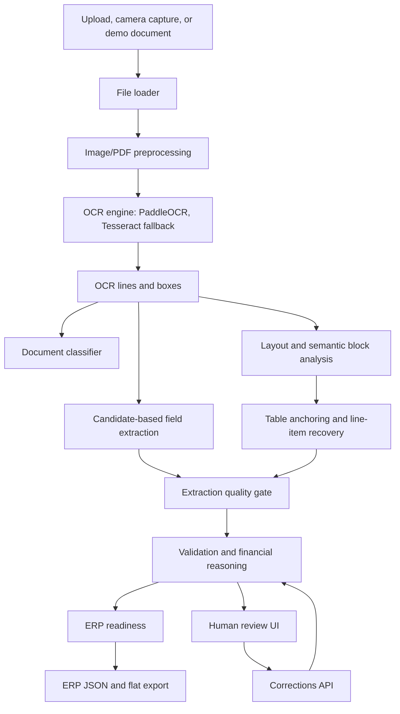

# Architecture Overview

The project is a FastAPI document-intelligence system for converting invoices and related commercial documents into ERP-ready JSON.

## Main Backend Modules

- `app/api/routes.py`: FastAPI endpoints for processing, demo documents, corrections, and ERP export.
- `app/services/pipeline_runner.py`: shared processing pipeline used by the API and scripts.
- `app/services/ocr_engine.py`: OCR engine orchestration and normalized OCR output.
- `app/services/document_layout.py` and `app/services/layout_analyzer.py`: layout regions and document structure.
- `app/services/field_extractor.py`: candidate extraction and scoring.
- `app/services/line_item_extractor.py`: product row recovery and rejection of non-product rows.
- `app/services/extraction_quality.py`: guardrail that separates validated rows from review rows.
- `app/services/financial_reasoner.py`: totals and business consistency checks.
- `app/services/erp_readiness.py`: final export readiness decision.
- `app/services/correction_store.py`: human correction persistence and correction-based revalidation.

## Frontend

- `app/static/index.html`: single-page review workspace.
- `app/static/app.js`: upload, demo processing, preview overlays, editable fields, line items, corrections, and JSON panels.
- `app/static/styles.css`: responsive professional review UI.

## Safety Principle

The system is designed for safe automation. A document can be extracted without being exportable. ERP export should be enabled only when required fields, line rows, and financial checks are sufficiently validated.

