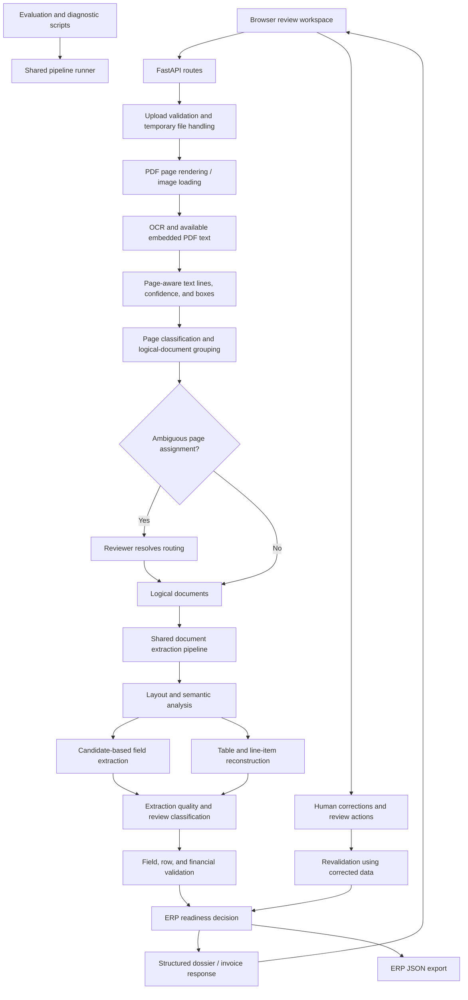

# Architecture overview

The application is a FastAPI service with a vanilla JavaScript review interface. Its central boundary is between **extraction** (what the document appears to say) and **export readiness** (whether the structured result has enough evidence and passes validation).

```mermaid
flowchart TD
    UI[Browser review workspace] --> API[FastAPI routes]
    CLI[Evaluation and diagnostic scripts] --> RUNNER[Shared pipeline runner]
    API --> LOAD[Upload validation and temporary file handling]
    LOAD --> PAGES[PDF page rendering / image loading]
    PAGES --> OCR[OCR and available embedded PDF text]
    OCR --> EVIDENCE[Page-aware text lines, confidence, and boxes]
    EVIDENCE --> ROUTE[Page classification and logical-document grouping]
    ROUTE --> REVIEWROUTE{Ambiguous page assignment?}
    REVIEWROUTE -->|Yes| ROUTING[Reviewer resolves routing]
    ROUTING --> GROUP[Logical documents]
    REVIEWROUTE -->|No| GROUP
    GROUP --> PIPE[Shared document extraction pipeline]
    PIPE --> LAYOUT[Layout and semantic analysis]
    LAYOUT --> FIELDS[Candidate-based field extraction]
    LAYOUT --> TABLES[Table and line-item reconstruction]
    FIELDS --> QUALITY[Extraction quality and review classification]
    TABLES --> QUALITY
    QUALITY --> VALIDATE[Field, row, and financial validation]
    VALIDATE --> READY[ERP readiness decision]
    READY --> RESPONSE[Structured dossier / invoice response]
    RESPONSE --> UI
    UI --> CORRECTIONS[Human corrections and review actions]
    CORRECTIONS --> REVALIDATE[Revalidation using corrected data]
    REVALIDATE --> READY
    READY --> EXPORT[ERP JSON export]
```

## Request and data flow

1. **Entry points.** `POST /process-dossier` is the multi-page review workflow. `POST /process-invoice` is the single-document path. Dataset and diagnostic scripts use the shared services rather than defining a separate production extractor.
2. **Input handling.** `app/services/file_loader.py` validates supported file types and loads images/PDF pages. PDF pages are rendered for image-based OCR; embedded PDF text may also be available. Uploaded temporary files are removed by the route after processing.
3. **OCR evidence.** `app/services/ocr_engine.py` normalizes OCR into text lines with confidence, geometry, and page provenance. PaddleOCR is the primary engine; Tesseract is an optional fallback when configured/available. Evidence should be checked against the original page image, particularly for multilingual documents.
4. **Dossier structure.** The dossier path classifies physical pages and groups them into logical documents. If page-to-document assignment is ambiguous, the API can return routing information for reviewer resolution before continuing. Physical page selection and logical-document selection are separate UI concepts.
5. **Extraction.** The shared pipeline analyzes layout/semantic regions, generates and scores field candidates, and invokes document-family extractors (including producer invoices, RUSPINA invoices, and TradeNet/customs documents). Table reconstruction produces candidate rows and separates accepted rows from rows requiring review.
6. **Validation and readiness.** Extraction-quality checks, field validation, financial reasoning, and ERP-readiness rules determine what can be exported. A detected value is not automatically trusted; unresolved required fields, arithmetic conflicts, incomplete rows, or low-confidence evidence can keep a document in review.
7. **Human review.** `app/static/app.js` renders the response, page preview, overlays, fields, and rows. Corrections are sent through review/correction routes and revalidated without requiring OCR to be rerun. Correction records are persisted locally by the correction store.
8. **Export.** ERP JSON routes serialize the validated/reviewed response. This is an integration boundary, not a live connection to an ERP product.

## Main modules

| Area | Responsibility |
| --- | --- |
| `app/main.py` | FastAPI app construction, static UI, and health/root routes |
| `app/api/routes.py` | Upload, dossier routing, review, correction, evaluation, and export endpoints |
| `app/core/config.py` | Environment-backed runtime settings and paths |
| `app/core/schemas.py` | Typed API and response contracts |
| `app/services/file_loader.py` | Upload format validation and page/image loading |
| `app/services/ocr_engine.py` | OCR orchestration and normalized evidence |
| `app/services/pipeline_runner.py` | Shared OCR-to-extraction processing orchestration |
| `app/services/document_layout.py`, `layout_analyzer.py` | Layout regions, semantic structure, and spatial evidence |
| `app/services/field_extractor.py` | Candidate generation/scoring and field extraction |
| Family-specific extractors under `app/services/` | Producer, RUSPINA, TradeNet, and other document-family rules |
| `app/services/line_item_extractor.py` | Table row reconstruction and row-level review classification |
| `app/services/extraction_quality.py` | Extraction quality checks and accepted/review separation |
| `app/services/financial_reasoner.py`, `validator.py` | Financial consistency and business validation |
| `app/services/erp_readiness.py`, `erp_mapper.py` | Readiness decision and export mapping |
| `app/services/correction_store.py` | Local correction persistence and correction-based revalidation |
| `app/static/index.html`, `app.js`, `styles.css` | Single-page review UI, behavior, localization, and responsive layout |

## API groups

The current route definitions are in `app/api/routes.py`; `/docs` exposes the running OpenAPI schema. Important workflows include:

- Processing: `POST /process-dossier`, `POST /process-invoice`
- Routing: `POST /resolve-dossier-routing`
- Review and correction: `POST /review/reconcile-dossier`, `POST /review/validate-corrections`, `POST /corrections`
- Export: `POST /export-erp-json`, `POST /export-simple-dossier-json`
- Supporting routes: demo-document processing, dataset evaluation, and `GET /health`

## Configuration and optional components

Settings are defined in `app/core/config.py` and documented in `.env.example`. Important settings include output location (`INVOICE_OCR_OUTPUT_DIR`), upload-size limit, low-confidence threshold, OCR profiles/modes, and optional layout/table-model switches. The default workflow does not require optional Table Transformer/layout model experiments. Check the current config class and `.env.example` before changing deployment settings; avoid duplicating defaults in documentation.

The UI defaults to French with English fallback. OCR source data is not translated. The app can preserve Arabic source text, but Arabic UI localization and RTL layout are not implemented.

## Trust and deployment boundaries

- OCR confidence is an internal signal, not ground-truth accuracy.
- Original document images are the verification source for recognized text and geometry.
- Client PDFs, OCR evidence, generated client JSON, and client ground truth must remain local and must not enter Git history.
- The application does not provide production authentication, role-based access control, a multi-tenant database, or a live ERP connector.
- The root Dockerfile is a general build. Production deployment requires environment-specific security, storage, resource, monitoring, and retention controls.
