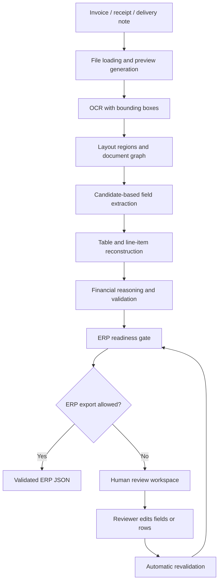

# Smart OCR-to-ERP Platform

Smart OCR-to-ERP Platform is a FastAPI document-intelligence application that reads invoice documents, extracts ERP fields, reconstructs line items, validates financial consistency, and gives reviewers a visual workspace before ERP export.

The production workflow is deterministic by default. It uses OCR, layout analysis, candidate scoring, table reconstruction, financial validation, and human review. The goal is not only to read text, but to decide whether the extracted business data is safe enough for ERP.

## What This Project Does

- Reads PDFs, scanned PDFs, and image documents.
- Preserves OCR text, confidence, bounding boxes, page size, and coordinate space.
- Detects layout regions such as supplier, customer, metadata, products, totals, payment, taxes, footer, and notes.
- Extracts invoice fields with deterministic candidate scoring.
- Reconstructs product and service line items from OCR boxes.
- Repairs inconsistent financial candidates when a clean totals triplet is available.
- Validates HT/subtotal, VAT, TTC, tax rate, row totals, and ERP-required fields.
- Blocks unsafe ERP export when values are missing, inconsistent, or low-confidence.
- Provides a browser review UI with document preview overlays, editable fields, editable line items, automatic revalidation, and validated ERP JSON export.
- Stores correction evidence for audit and future rule-based learning.
- Includes benchmark and regression tooling for datasets and extraction quality.

The operating rule is simple: automate reliable extraction, review uncertainty, and never export weak financial data silently.

## Main Pipeline



## Why The Main System Is Deterministic

ERP extraction needs traceability. The normal request path avoids automatic generative correction because deterministic extraction is:

- easier to audit;
- faster and cheaper to run;
- testable with regression fixtures;
- safer for totals, VAT, and row-level arithmetic;
- independent of local LLM availability;
- tied to OCR evidence, layout geometry, and validation rules.

Experimental advisory LLM files may exist in the repository for research comparison, but the default production/demo path does not rely on them and cannot bypass ERP validation.

## Core Capabilities

### OCR And Visual Evidence

- PaddleOCR primary engine.
- Tesseract-compatible fallback paths when configured.
- Bbox-aware OCR cache validation.
- PDF and image preview generation.
- Visual overlays for OCR boxes, layout blocks, field boxes, and line rows.
- Clickable regions with evidence, confidence, page, and source details.

### Field Extraction

The deterministic engine extracts supplier and customer data, invoice metadata, currency, HT/subtotal, VAT/tax amount, TTC/grand total, tax rate, bank details, line items, validation status, and ERP readiness.

Each rich field can include value, confidence, bbox, page, line index, source, and candidate evidence.

### Table And Line-Item Recovery

- Header detection with English and French aliases.
- Column inference from OCR x-positions.
- Wrapped description handling.
- Quantity, unit, unit price, discount, tax rate, HT, VAT, and TTC support.
- Product rows separated from totals, payment, footer, and bank text.
- Human-edited rows become verified when their values are complete and mathematically valid.

### Financial Validation

The system validates:

- `HT + VAT = TTC`;
- tax-rate plausibility;
- row arithmetic;
- line total sum vs subtotal;
- negative totals on non-credit invoices;
- missing ERP-required fields.

When selected totals are inconsistent, the extractor can recover a stronger candidate triplet from the totals block.

### Review UI

The review workspace supports upload or camera capture, demo documents, visual overlays, editable ERP fields, editable line items, automatic revalidation after edits, manual `Save & recheck` / `Save table & recheck`, financial checks, diagnostics, and validated ERP JSON export.

## Project Structure

```text
app/
  api/                 FastAPI routes
  core/                settings and response schemas
  services/            OCR, layout, extraction, validation, ERP, review services
  static/              browser review UI
dataset/
  demo/                demo documents
  images/              sample images
  labels/              sample labels
  manual_ground_truth_benchmark/
docs/                  architecture, benchmark, setup, demo notes
scripts/               benchmark and analysis utilities
tests/                 regression and integration tests
run.py                 local application entry point
requirements.txt       Python dependencies
```

## Quick Start

```powershell
cd D:\Stage_udgroup\invoice-ocr-erp
python -m venv .venv
.\.venv\Scripts\Activate.ps1
python -m pip install --upgrade pip
python -m pip install -r requirements.txt
python run.py
```

Open the UI:

```text
http://127.0.0.1:8000/
```

Open Swagger/OpenAPI:

```text
http://127.0.0.1:8000/docs
```

## API Usage

```powershell
curl.exe -X POST "http://127.0.0.1:8000/process-invoice" -F "file=@invoice.png"
curl.exe "http://127.0.0.1:8000/demo-documents"
```

Review corrections are validated through:

```text
POST /review/validate-corrections
```

## Useful Commands

Run tests:

```powershell
.\.venv\Scripts\python.exe -m pytest -q
```

Compile check:

```powershell
.\.venv\Scripts\python.exe -m compileall app scripts tests
```

Run the app:

```powershell
python run.py
```

Smoke benchmark:

```powershell
.\.venv\Scripts\python.exe .\scripts\evaluate_dataset.py --mode smoke
```

Multi-dataset smoke benchmark:

```powershell
.\.venv\Scripts\python.exe .\scriptsenchmark_multi_datasets.py --datasets-root D:\Stage_udgroup\sources\datasets --limit-per-dataset 5 --seed 42
```

## Recommended Demo Flow

1. Start the app with `python run.py`.
2. Open the review UI.
3. Load a clean demo invoice.
4. Show OCR boxes, layout blocks, field boxes, and line rows.
5. Click a field or row to show visual evidence.
6. Edit a line item or field.
7. Show automatic revalidation and the refreshed ERP readiness status.
8. Use `Save & recheck` or `Save table & recheck`.
9. Export validated ERP JSON only when ERP readiness is clear.
10. Load a noisy document and show that unsafe export is blocked.

## Confidence And Accuracy

OCR confidence is not true accuracy. OCR confidence is not true business accuracy. OCR confidence measures recognized text certainty. Extraction confidence measures candidate quality. ERP readiness depends on required fields, financial consistency, row validation, and review status.

True accuracy claims require manually verified ground-truth labels.

## Current Limitations

- Some unusual supplier/customer layouts still need human review.
- Table reconstruction can require review on heavily merged rows or low-quality scans.
- Correction memory is rule-based, not ML training.
- Production deployment still needs authentication, reviewer roles, database-backed audit storage, and ERP-specific connectors.

## License

Add the license that matches your intended usage before distributing this project commercially.
