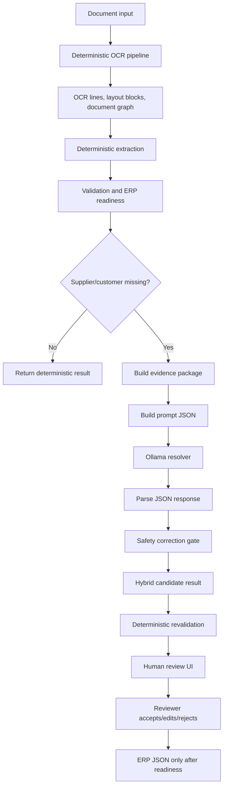
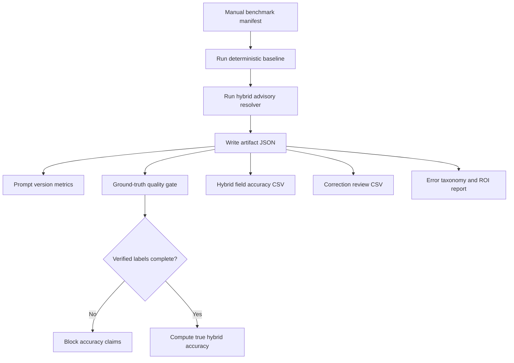

# Hybrid LLM Architecture

The hybrid LLM layer is an optional advisory system around the deterministic OCR-to-ERP pipeline. It is designed to help reviewers resolve uncertain fields without allowing the model to silently rewrite ERP data.

## Design Rule

The deterministic pipeline remains the source of truth.

The LLM can propose corrections, but proposals must pass the safety gate and remain visible to the reviewer. In the v1.1 advisory release, auto-apply remains disabled.

## Flow

## Routing

Routing is implemented in the hybrid resolver path and controlled by settings.

Current release policy:

- LLM is optional.
- Recommended mode is advisory.
- Recommended trigger is missing supplier or missing customer.
- Low-confidence routing exists for benchmark and review experiments, but broad deployment is not recommended until verified labels are complete.

## Evidence Building

The evidence builder creates a compact structured package from deterministic outputs. It includes candidate values, confidence, field evidence, layout/context signals, totals information, table signals, warnings, and validation status.

The model receives structured JSON evidence instead of a raw OCR text dump. This keeps the prompt bounded and makes correction proposals traceable.

## Prompt Generation

Prompt generation supports multiple prompt versions:

- `hybrid_prompt_v1`
- `hybrid_prompt_v2`
- `hybrid_prompt_v3`
- `hybrid_prompt_v4`

`hybrid_prompt_v3` is selected for the advisory release because it produced valid JSON in the real calibration run and passed the safety gate more reliably than v4.

## Ollama Resolver

The resolver calls a local Ollama model. The default model is configurable and has been tested with Qwen2.5-Coder 7B.

The resolver records:

- whether it was invoked;
- trigger reasons;
- model name;
- latency;
- raw response;
- parsed response;
- proposals;
- accepted/rejected gate decisions;
- fallback reason when the model times out or returns unusable output.

## Response Parser

The parser accepts only structured JSON. Malformed responses are rejected and the deterministic result remains active.

The parser must not convert unsupported natural-language reasoning into ERP changes.

## Correction Gate

The correction gate validates each proposed correction against available evidence.

It rejects:

- unsupported corrections;
- hallucinated values;
- protected high-confidence deterministic overwrites;
- financial/table changes without strong verified evidence;
- proposals without evidence references.

Accepted proposals are still advisory in this release because auto-apply is disabled.

## Candidate Application

Candidate application builds a hybrid candidate result for review. It does not replace the deterministic production result unless the deployment mode and gate allow it.

For v1.1, deployment recommendation is advisory only.

## Deterministic Revalidation

After any correction, deterministic validation runs again. ERP readiness is recalculated by deterministic code, not by the LLM.

## Review Assistant

The review assistant explains:

- suspected problems;
- candidate choices;
- confidence;
- suggested correction;
- evidence;
- ERP impact.

It does not modify extraction automatically.

## Cache

LLM responses can be cached for benchmark repeatability and local iteration. Cache data is local runtime output and should not be committed.

## Benchmark Flow

## Release Recommendation

For v1.1, deploy the LLM only as an advisory assistant when supplier or customer is missing. Keep OCR, invoice numbers, dates, totals, VAT, tables, validation, and ERP readiness deterministic.
