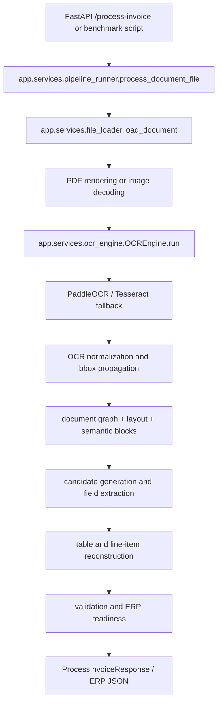

# Large Benchmark Architecture

This audit documents the current benchmark entry points before running large dataset work. The goal of P1 is production stabilization and resumable evaluation, not extraction redesign.

## Authoritative Application Path

All production-style benchmark execution must call the same service path used by the API:



`scripts/large_benchmark_runner.py` uses `process_document_file(...)` directly. This keeps benchmark behavior aligned with the live API and avoids a second extraction path.

## Current Benchmark Scripts

| Script | Current role | Uses real pipeline | Notes |
|---|---:|---:|---|
| `scripts/benchmark_multi_datasets.py` | Main CLI wrapper for multi-dataset benchmark | Yes | Now dispatches P1 runs when `--run-id`, `--size`, `--resume`, or other P1 flags are used. Old shared-output mode remains available. |
| `scripts/large_benchmark_runner.py` | P1 resumable benchmark engine | Yes | Run-isolated output, stable document IDs, atomic checkpoint, JSONL streaming, retry modes, profile recording. |
| `scripts/evaluate_dataset.py` | Earlier tiered evaluator | Partially | Has its own checkpoint/cache structure and should be considered legacy for large multi-dataset runs. |
| `scripts/benchmark_8000.py` | Earlier 8k-specific benchmark | Partially | Writes CSV/predictions but lacks P1 stable run isolation and robust checkpoint schema. |
| `scripts/benchmark_manual_ground_truth.py` | Small manually verified benchmark | Yes | Still useful for true accuracy checks on curated labels. |
| `scripts/real_ocr_baseline.py` | Performance baseline | Yes | Uses subprocess for cold-start measurement; not intended for large dataset evaluation. |
| `scripts/ocr_experiments.py` | OCR configuration experiments | Yes | Used for P0 profile discovery. Not a benchmark runner for datasets. |
| `scripts/time_pipeline.py` | One-off timing utility | Yes | Useful for focused performance checks. |

## P1 Run Folder

New large benchmark runs write to:

`dataset/reports/benchmark_runs/<run_id>/`

Expected files:

- `checkpoint.json`
- `manifest.json`
- `configuration.json`
- `environment.json`
- `results.jsonl`
- `results.csv`
- `timings.csv`
- `errors.csv`
- `timeouts.csv`
- `skipped.csv`
- `summary.json`
- `report.md`
- `report.html`
- `run.log`
- `errors/<document_id>.log`
- `artifacts/<document_id>.json`
- `partial_results/results_stream.csv`

## Stable Document Identity

P1 document IDs are derived from:

- dataset name
- normalized relative path under the dataset root
- file size
- SHA-256 file hash

This prevents duplicate work across resume/retry flows while still detecting file content changes.

## OCR Profiles

The default OCR profile is:

`optimized_mobile_v4`

Rollback profile:

`legacy_v6_medium`

The effective OCR profile is recorded in `environment.json`, `configuration.json`, `checkpoint.json`, and each result row. Low-level environment variables can override profile values. OCR cache keys include the effective Paddle fingerprint, so optimized and legacy OCR runs do not reuse incompatible cache entries.

## Resume And Retry

The checkpoint stores:

- run status
- selected document IDs
- completed document IDs
- failed document IDs
- skipped document IDs
- current and last completed document
- configuration hash
- OCR profile and model details
- result file locations
- git and Python metadata

Writes use a temporary file plus `os.replace(...)` so an interruption should not corrupt `checkpoint.json`.

`results.jsonl` is flushed and fsynced after every document. A truncated final line is ignored when loading existing results.

## P1.1 Status Semantics

Benchmark rows now separate independent concepts:

- `execution_status`: whether the Python pipeline attempt completed, failed, timed out, was skipped, or was interrupted.
- `extraction_status`: the document validation result: `valid`, `needs_review`, `invalid`, or `unavailable`.
- `erp_status`: whether the result is `ready`, `blocked`, `rejected`, or `unavailable` for ERP export.

The legacy `status` column is retained as an alias for `execution_status`. It must not be interpreted as business validity.

Validation failures such as missing customer or invalid totals are not execution errors. They are recorded in:

- `validation_failure_reasons`
- `missing_required_fields`
- `erp_blocking_reasons`
- `suspicious_field_codes`
- `confidence_warning_codes`

## Attempt History

`results.jsonl` remains append-only and contains every attempt. Retry attempts receive:

- `attempt_id`
- `attempt_number`
- `is_retry`
- `retry_reason`
- `previous_attempt_id`
- `previous_execution_status`
- cache and Paddle call metadata

Generated CSVs:

- `attempts.csv`: one row per attempt.
- `document_latest_results.csv`: latest selected attempt per document.
- `results.csv`: compatibility alias for latest selected attempts.

## Performance Populations

The primary benchmark performance metric uses fresh OCR attempts only:

- `execution_status = completed`
- `fresh_ocr = true`
- `total_paddle_calls >= 1`
- `disk_cache_hit = false`
- `memory_cache_hit = false`
- `reuse_ocr = false`

Reports also generate separate performance files:

- `performance_fresh_ocr.json`
- `performance_cached.json`
- `performance_all_attempts.json`

Cached retries are useful operationally, but they are excluded from the primary fresh-OCR median and percentile metrics.

## Timeout Semantics

`document_timeout` is currently a soft performance budget. It does not hard-kill PaddleOCR mid-call.

Rows include:

- `timeout_mode = soft`
- `timeout_limit_seconds`
- `exceeded_timeout_budget`
- `completed_after_timeout_budget`
- `hard_terminated = false`
- `performance_violation`

## Known Risks Before Medium/Full Runs

- `--document-timeout` currently marks over-budget documents after completion; it does not kill a long OCR call mid-document. A hard timeout would require a process-isolated worker.
- `--workers` is accepted and recorded, but safe execution currently runs serially. This avoids PaddleOCR thread/process instability on Windows.
- Legacy benchmark scripts still exist and may produce reports in older folders. For large multi-dataset work, use the P1 run folder only.
- OCR extraction remains the dominant cost. P1 stabilizes measurement and resume behavior; it does not change extraction logic.
- Ground-truth schemas vary heavily. Completeness metrics remain more reliable than accuracy unless labels are manually verified or adapter-compatible.

## Recommended Commands

Environment check:

```powershell
python scripts/benchmark_multi_datasets.py --run-id optimized_p1_env --size smoke --ocr-profile optimized_mobile_v4 --check-env
```

Smoke:

```powershell
python scripts/benchmark_multi_datasets.py --run-id optimized_p1_smoke_01 --size smoke --ocr-profile optimized_mobile_v4 --workers 1 --document-timeout 120
```

Resume:

```powershell
python scripts/benchmark_multi_datasets.py --run-id optimized_p1_smoke_01 --resume
```

Medium, only after smoke is stable:

```powershell
python scripts/benchmark_multi_datasets.py --run-id optimized_p1_medium_01 --size medium --ocr-profile optimized_mobile_v4 --workers 1 --document-timeout 120
```
