# Performance Pipeline Audit

This audit maps the current document-processing path before any performance optimization. It intentionally does not change OCR configuration, extraction logic, business rules, or response structure.

## Scope

The audited runtime path is the production-style FastAPI pipeline that starts at `/process-invoice` and ends with `ProcessInvoiceResponse`. CLI and benchmark paths are included separately because some scripts reuse the same orchestrator while others duplicate major stages.

## Pipeline Diagram

```mermaid
flowchart TD
    A["Browser UI or API client"] --> B["app.api.routes.process_invoice"]
    B --> C["save_upload_to_temp"]
    C --> D["pipeline_runner.process_document_file"]
    D --> E["file_loader.load_document"]
    E --> F{"PDF?"}
    F -->|Yes| G["_load_pdf: PyMuPDF text + 2x page render"]
    F -->|No| H["_load_image: cv2.imread"]
    G --> I["LoadedDocument(images, embedded_text)"]
    H --> I
    I --> J["OCREngine.run"]
    J --> K{"embedded text exists?"}
    K -->|Yes| L["Create OCRLine without bbox from text"]
    K -->|No or images also exist| M["OCREngine._run_paddle"]
    M --> N["_get_paddle_ocr cached singleton"]
    N --> O["build_ocr_regions"]
    O --> P["_run_paddle_region"]
    P --> Q["_preprocess_for_region"]
    Q --> R["_ocr_cache_key"]
    R --> S{"memory/disk cache hit?"}
    S -->|Yes| T["cache item -> OCRLine"]
    S -->|No| U["_run_paddle_prediction"]
    U --> V["_iter_paddle_items"]
    V --> W["normalize_paddle_bbox + page coordinate mapping"]
    W --> X["OCR schema v2 disk cache write"]
    X --> T
    T --> Y["_dedupe_ocr_lines -> OCRResult"]
    Y --> Z["_process_ocr_document"]
    Z --> AA["generate_document_preview"]
    AA --> AB["LayoutAnalyzer.detect_layout_blocks"]
    AB --> AC["document_layout.analyze_document_layout"]
    AC --> AD["classify_document"]
    AD --> AE["extract_with_candidates"]
    AE --> AF["collect_field_candidates"]
    AF --> AG["graph/layout/regex/spatial/memory candidate generation"]
    AG --> AH["resolve_parties + select/rank candidates"]
    AH --> AI["extract_line_items"]
    AI --> AJ["reconstruct_tables / anchored rows / regex fallback"]
    AJ --> AK["apply_extraction_quality_gate"]
    AK --> AL["expanded fields + field boxes"]
    AL --> AM["validate_invoice"]
    AM --> AN["validate_rows + reason_financials"]
    AN --> AO["calculate_confidence + assess_erp_readiness"]
    AO --> AP["build_erp_json + dynamic review payload"]
    AP --> AQ["optional write_erp_json + validation report"]
    AQ --> AR["map_to_flat_erp + validated ERP JSON"]
    AR --> AS["apply_public_bbox_contract"]
    AS --> AT["response.model_dump timing"]
    AT --> AU["FastAPI Pydantic response JSON"]
    AU --> AV["app/static/app.js renderResults + preview overlays"]
```

## Real Entry Points

### API/UI

- `run.py`
  - Starts `uvicorn.run("app.main:app", host="127.0.0.1", port=PORT, reload=True)`.
- `app.main.app`
  - Registers API routes from `app.api.routes.router`.
  - Serves `/` as `app/static/index.html`.
  - Mounts `/static`.
  - Exposes `/health`.
- `app.api.routes.process_invoice`
  - `POST /process-invoice`.
  - Saves the upload via `save_upload_to_temp`.
  - Calls `process_document_file(..., include_preview=True, persist_erp_json=True)`.
  - Deletes the temporary upload in `finally`.
- `app.api.routes.process_demo_document`
  - `POST /demo-documents/{demo_id}/process`.
  - Calls the same `process_document_file`, but with `persist_erp_json=False`.
- `app.api.routes.evaluate_dataset`
  - Calls `scripts/evaluate_dataset.py` through `subprocess.run`.
  - This is a web-exposed subprocess path and is not the same as the normal request pipeline.
- `app.api.routes.submit_invoice_corrections`
  - `POST /corrections`.
  - Calls `submit_corrections`.
- `app.api.routes.validate_invoice_review_corrections`
  - `POST /review/validate-corrections`.
  - Calls `validate_review_corrections`.
- `app.api.routes.export_erp_json`
  - `POST /export-erp-json`.
  - Calls `map_to_flat_erp` only.

### CLI and Benchmark

- `scripts/benchmark_multi_datasets.py`
  - Uses `process_document_file`.
  - This is currently the closest benchmark path to the real API path.
- `scripts/benchmark_table_heavy.py`
  - Uses `process_document_file`.
  - Has a `--reuse-ocr` mode that builds an `OCRResult` from prediction JSON and then calls `process_loaded_document` with a fake engine.
- `scripts/evaluate_dataset.py`
  - Duplicates most of the pipeline manually instead of calling `process_document_file`.
  - Has separate OCR and layout caches under `outputs/cache/ocr` and `outputs/cache/layout`.
- `scripts/benchmark_8000.py`
  - Duplicates the older extraction path manually and does not include the newer quality/business/readiness stages from `pipeline_runner`.
- `scripts/benchmark_manual_ground_truth.py`
  - Uses manual benchmark helpers; this audit did not trace it deeply.
- `run_benchmarks.ps1`
  - Wrapper entry for benchmark runs; not part of live request processing.

## Main Call Flow

### 1. Request and File Handling

1. `app.api.routes.process_invoice(file)`
2. `app.services.file_loader.save_upload_to_temp(upload_file)`
3. `app.services.pipeline_runner.process_document_file(path, original_filename, ocr_engine, include_preview=True, persist_erp_json=True)`

Disk I/O in this phase:

- temporary upload file is written with `NamedTemporaryFile`;
- temporary file is deleted after request completion.

### 2. File Loading

`process_document_file` calls:

- `load_document(path, original_filename)`

Then:

- For images: `_load_image`
  - Uses `cv2.imread`.
  - Returns one BGR `np.ndarray`.
- For PDFs: `_load_pdf`
  - Uses `fitz.open`.
  - Extracts embedded text with `page.get_text("text")`.
  - Renders every page at `fitz.Matrix(2, 2)` using `page.get_pixmap`.
  - Converts RGB to BGR via OpenCV.

Potential repeated work:

- PDF page rendering happens here.
- Preview generation later writes images again from the already loaded arrays, so rendering itself is not repeated in the live pipeline, but image encoding/writing is.

### 3. OCR Engine Initialization

`process_document_file` uses:

- the module-level shared `ocr_engine = OCREngine()` from `app.api.routes`, or
- creates a new `OCREngine(...)` when none is provided.

Inside Paddle:

- `_get_paddle_ocr` is decorated with `@lru_cache(maxsize=1)`.
- It creates `PaddleOCR(lang="en", enable_mkldnn=False, use_doc_orientation_classify=False, use_doc_unwarping=False, use_textline_orientation=False)`.
- If newer arguments fail with `ValueError("Unknown argument")`, it falls back to `PaddleOCR(lang="en")`.

Observed initialization behavior:

- `OCREngine` objects may be recreated by scripts, but PaddleOCR itself is process-cached through `_get_paddle_ocr`.
- `uvicorn` runs with `reload=True`, so development reloads create a new process and reinitialize the Paddle singleton.

### 4. OCR Execution and Normalization

`OCREngine.run(images, embedded_text)`:

- Initializes per-run timing counters through `_reset_run_metrics`.
- Converts embedded PDF text into OCR lines if available.
- Runs Paddle if images exist.
- If Paddle fails and `settings.enable_tesseract_fallback` is true, calls `_run_tesseract`.
- Deduplicates OCR lines by normalized text only via `_dedupe_ocr_lines`.
- Returns `OCRResult(raw_text, lines, confidence, engine, page_count)`.

Paddle path:

1. `_run_paddle(images)`
2. `_get_paddle_ocr()`
3. `_regions_for_mode(image)`
   - `fast` and `balanced`: full page only.
   - `accurate`: all regions from `build_ocr_regions`.
4. `_run_paddle_region(paddle, region, page_number, source)`
5. `_preprocess_for_region(region)`
   - full page: `preprocess_image`
   - cropped/fallback regions: `preprocess_table_region`
6. `_ocr_cache_key(processed, region.image, region.name, page_number, self.mode, region.coordinates)`
7. memory cache check
8. disk cache check through `_read_disk_cache`
9. `_run_paddle_prediction`
10. `_iter_paddle_items`
11. `normalize_paddle_bbox`
12. `_item_with_page_bbox`
13. `_write_disk_cache`
14. cached item to `OCRLine`

Tesseract fallback path:

- `_run_tesseract(images)`
- `_tesseract_data_lines` for full-page regions, preserving line bboxes.
- `_tesseract_string_lines` for non-full-page regions, text-only.

### 5. Cache Reads and Writes

Live OCR cache:

- Memory cache: `OCREngine._ocr_cache`.
- Disk cache: `settings.ocr_cache_dir`, default `.cache/ocr`.
- Cache key includes:
  - processed image hash,
  - source image hash,
  - page number,
  - OCR mode,
  - region name,
  - region coordinates,
  - processed shape,
  - preprocessing version,
  - OCR cache schema version,
  - Paddle fingerprint.
- Current cache schema version: `OCR_CACHE_SCHEMA_VERSION = 2`.
- Cache write includes:
  - `schema_version`,
  - `engine`,
  - `ocr_mode`,
  - `preprocessing_version`,
  - region metadata,
  - coordinate mapping,
  - geometry status,
  - cached OCR items.
- Cache read rejects:
  - disabled cache,
  - refresh mode,
  - missing file,
  - incompatible schema,
  - missing/non-list items,
  - text items with zero bboxes.

Benchmark cache differences:

- `scripts/evaluate_dataset.py` stores OCR cache in `outputs/cache/ocr/{file_hash}.json`, using the full `OCRResult`, not the live `.cache/ocr` region cache.
- `scripts/evaluate_dataset.py` stores layout cache in `outputs/cache/layout/{file_hash}.json`.
- `scripts/benchmark_multi_datasets.py` relies on `process_document_file` and therefore uses the live OCR cache behavior unless disabled.

### 6. Preview Generation

`_process_ocr_document` calls:

- `generate_document_preview(document)` if `include_preview=True`.

Behavior:

- Writes one PNG per loaded image into `app/static/previews`.
- Uses `cv2.imwrite`.
- Uses SHA-1 of preview bytes plus source filename for filenames.
- Adds `PreviewPage(page, url, width, height)` to the response.

Potential duplicated work:

- The request has already decoded images or rendered PDF pages.
- Preview does not decode again, but it does encode/write each page to disk inside the request.
- `process_loaded_document` currently generates a preview before OCR when `include_preview=True`, then calls `_process_ocr_document(..., include_preview=False)`. It computes `document_preview` but does not pass it forward, which looks like wasted preview work for that code path.

### 7. Layout and Semantic Block Detection

In `_process_ocr_document`:

1. `LayoutAnalyzer(ocr_result.lines).detect_layout_blocks()`
   - Public `LayoutBlock` output.
   - Zone and keyword heuristics.
   - Produces supplier, invoice metadata, customer, products, totals, payment, footer, notes, taxes, unknown.
2. `analyze_document_layout(ocr_result.lines)`
   - Debug layout output.
   - Calls `group_ocr_lines`.
   - Calls `reconstruct_tables`.
   - Calls `detect_logical_blocks`.
   - Returns `ocr_lines`, `blocks`, and `tables`.

Duplicated work:

- Layout blocks are produced by both `LayoutAnalyzer` and `document_layout.analyze_document_layout`.
- Later, `extract_with_candidates` calls layout functions again internally.

### 8. Document Classification

`classify_document(ocr_result.raw_text, ocr_result.lines)`:

- Classifies document type using text and OCR blocks.
- Used before extraction to adjust candidate scoring and downstream validation.

### 9. Candidate Generation and Field Extraction

`extract_with_candidates(text, ocr_blocks, classification)`:

1. Normalizes text.
2. Calls `collect_field_candidates`.
3. Calls `_select_best_candidates`.
4. Calls `resolve_parties`.
5. Calls `_prefer_consistent_total_candidates`.
6. Calls `_separate_party_candidates`.
7. Builds `ExtractedInvoiceFields`.
8. Calls `extract_line_items`.
9. Builds `field_confidences`.
10. Builds graph debug and table debug.
11. Builds field traces.

`collect_field_candidates` sources:

- Regex fields:
  - `_extract_invoice_number`
  - `_extract_invoice_date`
  - `_extract_due_date`
  - `_extract_currency`
  - `_extract_amount_ht`
  - `_extract_tva_amount`
  - `_extract_amount_ttc`
  - `_extract_purchase_order`
  - `_extract_supplier_tax_id`
  - `_extract_supplier_name` only when no OCR blocks are present.
- Per-line regex and label candidates:
  - `_add_line_candidates`
  - `_add_multiline_candidates`
  - `_add_block_sequence_candidates`
- Layout candidates:
  - `_add_layout_aware_candidates`
  - calls `group_ocr_lines`
  - calls `analyze_document_layout`
  - calls `reconstruct_tables`
- Graph candidates:
  - `add_graph_field_candidates`
  - internally builds a document graph.
- Date proximity:
  - `_add_spatial_date_candidates`
- Totals:
  - `_add_stacked_totals_candidates`
  - `_add_summary_table_candidates`
  - `_add_totals_block_candidates`
  - `_collect_labeled_amounts`
- Party extraction:
  - `_add_party_candidates_from_blocks`
  - `_add_safe_party_region_candidates`
  - `resolve_parties`
- Correction memory:
  - `boost_candidates_from_memory`
  - reads correction records from `outputs/corrections/corrections.jsonl` through `get_correction_memory`.

Duplicated work:

- `extract_with_candidates` calls `build_graph_debug(ocr_blocks)` after `collect_field_candidates`; graph candidate generation also builds graph data.
- `extract_with_candidates` calls `build_table_extraction_debug`, which calls `group_ocr_lines` and `reconstruct_tables` again.
- `_add_layout_aware_candidates` calls `analyze_document_layout` and `reconstruct_tables`, even though `_process_ocr_document` already computed `layout_debug`.

### 10. Supplier and Customer Extraction

Supplier/customer logic is distributed across:

- regex and header heuristics in `field_extractor`;
- `_add_layout_aware_candidates`;
- `_add_party_candidates_from_blocks`;
- `_add_safe_party_region_candidates`;
- `graph_field_extractor.add_graph_field_candidates`;
- `party_resolver.resolve_parties`;
- `correction_store.boost_candidates_from_memory`;
- quality gate validation for party field safety.

Key safety rules:

- `is_forbidden_party_name` and `is_company_candidate_text` reject weak/table/header tokens.
- `_separate_party_candidates` removes duplicate selected supplier/customer values.
- `apply_extraction_quality_gate` can withhold suspicious party values from ERP export.

### 11. Metadata Extraction

Metadata fields include:

- invoice/document number;
- invoice date;
- due date;
- purchase order/reference;
- currency.

Sources:

- regex in `collect_field_candidates`;
- OCR-block label proximity;
- spatial date candidate search;
- graph candidates;
- layout metadata block candidates.

### 12. Totals Extraction

Totals sources:

- regex totals extraction;
- totals block extraction from layout debug;
- summary table extraction;
- stacked totals heuristics;
- bottom-right totals cluster;
- graph totals candidates;
- reconstructed line total sum;
- consistent total combination selection.

Consistency steps:

- `_prefer_consistent_total_candidates` chooses consistent HT/TVA/TTC candidate triplets.
- `apply_extraction_quality_gate` calls `_recover_consistent_totals`.
- `validate_totals` checks HT + TVA ≈ TTC.
- `reason_financials` checks HT + VAT + shipping + stamp tax - discount ≈ TTC.

### 13. Table and Line-Item Extraction

`extract_line_items(text, blocks)`:

1. `extract_line_items_from_blocks`
2. `_extract_reconstructed_table_items`
   - calls `reconstruct_tables(blocks, group_ocr_lines(blocks))`
3. `_extract_anchored_table_rows`
   - detects table columns from header boxes;
   - detects stop rows;
   - detects row anchors;
   - parses anchored bands.
4. Coordinate row parsing:
   - groups blocks by y-position;
   - parses row text and numeric cells.
5. Text fallback:
   - `parse_line_item`
   - `_parse_flexible_line_item`

Later gates:

- `apply_extraction_quality_gate.validate_line_items`
- `row_validation_engine.validate_rows`
- `row_validation_engine.summarize_rows`

Duplicated work:

- `reconstruct_tables` is called in:
  - top-level `analyze_document_layout`;
  - `_add_layout_aware_candidates`;
  - `build_table_extraction_debug`;
  - `_extract_reconstructed_table_items`.

### 14. Financial Validation

The current financial path:

1. `validate_invoice`
   - required fields and basic total consistency.
2. `apply_extraction_quality_gate`
   - field and line-item quality decisions.
3. `validate_rows`
   - row arithmetic.
4. `summarize_rows`
   - row validation summary.
5. `reason_financials`
   - invoice-level financial consistency.
6. `assess_erp_readiness`
   - final ERP readiness decision.
7. `build_invoice_validation_report`
   - review report payload.

### 15. Confidence Calculation

Sources:

- OCR confidence: `OCRResult.confidence`.
- Layout confidence: average of `layout_blocks`.
- Table confidence: average of `layout_debug["tables"]`.
- Field confidence: average of selected field confidences.
- Financial confidence: `financial_reasoning["financial_consistency_score"]`.
- Validation confidence: `row_summary["validation_score"]`.
- ERP readiness confidence: `erp_readiness["erp_ready_score"]`.

Implementation:

- `calculate_confidence` is called twice:
  - once before ERP readiness, without ERP component;
  - once after ERP readiness, with ERP component.

### 16. ERP Readiness Decision

`assess_erp_readiness(fields, row_summary, financial, confidence)`:

- Requires invoice number, supplier, customer, invoice date, currency, and amount TTC.
- Adds row invalidity to blocking errors.
- Produces:
  - `erp_ready_score`;
  - `erp_ready_status`: `ERP Ready`, `Needs Review`, or `Rejected`;
  - `blocking_errors`;
  - `missing_fields`;
  - `ready`.

The pipeline then mutates `validation.status`:

- `Rejected` -> `invalid`;
- `Needs Review` -> `needs_review` if previously `valid`.

### 17. JSON Serialization and Disk Output

Response construction:

- `build_erp_json`
- `build_dynamic_review_payload`
- `build_validated_erp_json`
- `map_to_flat_erp`
- `ProcessInvoiceResponse(...)`
- `apply_public_bbox_contract`
- `response.model_dump(mode="json")` for serialization timing
- FastAPI serializes the Pydantic response.

Request-time disk writes:

- Upload temp file through `save_upload_to_temp`.
- Preview PNGs through `generate_document_preview`.
- OCR cache JSON through `_write_disk_cache`.
- ERP JSON through `write_erp_json` when `persist_erp_json=True`.
- Invoice validation report through `write_invoice_validation_report` when `persist_erp_json=True`.

Review-time disk writes:

- Correction records are appended to `outputs/corrections/corrections.jsonl`.

### 18. UI/API Response Preparation

Backend public response model:

- `ProcessInvoiceResponse` contains:
  - `extracted_text`;
  - `document_preview`;
  - `layout_blocks`;
  - `field_boxes`;
  - `ocr_blocks`;
  - `document_classification`;
  - `detected_fields`;
  - `expanded_fields`;
  - `field_confidences`;
  - `extraction_debug`;
  - `dynamic_tables`;
  - `extraction_layer`;
  - `erp_layer`;
  - `validation`;
  - `erp_json`;
  - `erp_export`;
  - `validated_erp_json`;
  - review candidates and line-item review payloads;
  - row validation, financial reasoning, confidence, readiness, fraud, duplicate, suggestions.

Public bbox contract:

- `apply_public_bbox_contract` normalizes OCR, layout, field, candidate, and line-item bboxes.
- It copies page width/height from `document_preview`.
- It sets `coordinate_space="original_page"` when bbox exists.
- It records `bbox_trace` in `extraction_debug`.

Frontend:

- `app/static/app.js`
  - `processUploadedFile` calls `/process-invoice`.
  - `processDemoDocument` calls `/demo-documents/{demo_id}/process`.
  - `renderResults` calls `normalizeReviewResponse`.
  - `normalizeReviewResponse` normalizes OCR, layout, and field boxes for overlays.
  - `renderPreview` draws preview image and overlay boxes.
  - `window.__REVIEW_DEBUG__` stores raw response, normalized response, overlay counts, and render errors.

## Current Timing Instrumentation

### In `pipeline_runner`

`timings` currently includes:

- `file_loading`
- `ocr`
- `layout_analysis`
- `field_extraction`
- `table_extraction`
- `business_reasoning`
- `public_boxes_count`
- `bbox_loss_stage`
- `report_serialization`

### In `OCREngine.last_timings`

Current keys include:

- `ocr_total`
- `ocr_engine_used`
- `ocr_mode`
- `paddle_initialization`
- `ocr_inference`
- `preprocessing`
- `full_page_preprocessing`
- `fallback_preprocessing`
- `full_page_ocr_inference`
- `fallback_ocr_inference`
- `region_ocr_calls`
- `region_timings`
- `duplicate_ocr_calls`
- `fallback_region_count`
- `ocr_cache_hits`
- `ocr_cache_misses`
- `memory_cache_hits`
- `disk_cache_hits`
- `cache_misses`
- `disk_cache_hit`
- `disk_cache_schema_version`
- `disk_cache_invalidated_reason`
- `ocr_cache_source`
- `cached_lines_count`
- `cached_lines_with_bbox`
- `raw_paddle_items_count`
- `raw_boxes_count`
- `normalized_boxes_count`
- `ocrline_boxes_count`
- `pre_api_boxes_count`
- `cached_boxes_count`
- `public_boxes_count`
- `bbox_loss_stage`
- `geometry_status`

### In Benchmarks

- `scripts/evaluate_dataset.py` records processing time, OCR cache hit, layout cache hit, validation status, field completeness, line-item counts, totals consistency, and progressive summaries.
- `scripts/benchmark_multi_datasets.py` records response `stage_timings` fields such as OCR engine, OCR mode, Paddle call count, fallback region count, disk cache hit, and OCR inference timings.
- `scripts/benchmark_table_heavy.py` writes `stage_timings` into CSV JSON strings.

## Missing Instrumentation

The current timing support is useful but incomplete for optimization decisions. Missing or too coarse:

- separate `preview_generation` timing in `process_document_file` live path;
- separate `classification` timing;
- separate `LayoutAnalyzer.detect_layout_blocks` vs `analyze_document_layout`;
- separate `extract_with_candidates` sub-timings:
  - regex candidates;
  - block sequence candidates;
  - layout-aware candidates;
  - graph candidates;
  - correction memory boost;
  - party resolver;
  - candidate ranking;
  - line-item extraction;
  - field trace/debug construction;
- count of `reconstruct_tables` calls per request;
- count of `group_ocr_lines` calls per request;
- correction memory file read timing and record count;
- preview disk-write timing and file size/page count;
- OCR disk cache read/write timings separately;
- PDF page count and render time per page;
- image decode time for `_load_image`;
- response JSON byte size;
- dynamic review payload build time;
- ERP JSON write time and validation-report write time;
- memory usage for large PDFs/images;
- UI render time from browser side.

## Suspected Bottlenecks

These are suspected from code structure only. They require measurement before optimization.

1. Paddle OCR inference
   - `_run_paddle_prediction` is likely the dominant runtime cost on uncached documents.
   - Accurate mode can run every region from `build_ocr_regions`, multiplying OCR calls.

2. Image preprocessing
   - `preprocess_image` includes resize, denoising, CLAHE, deskew, adaptive threshold.
   - It runs per OCR region before cache lookup because the cache key hashes the processed image.

3. PDF loading/rendering
   - `_load_pdf` extracts text and renders every page at 2x.
   - Large multi-page PDFs will load and render all pages synchronously.

4. Preview disk writes
   - `generate_document_preview` writes PNG previews inside the request.
   - For many pages or large images, this adds synchronous disk I/O.

5. Repeated layout/table reconstruction
   - `analyze_document_layout` and `LayoutAnalyzer.detect_layout_blocks` both run.
   - `reconstruct_tables` can run multiple times per request.
   - `group_ocr_lines` can run multiple times per request.

6. Document graph creation
   - `add_graph_field_candidates` and `build_graph_debug` may both build graph-like structures.
   - `DocumentGraph` builds edges between nearby nodes, which can become expensive as OCR line count grows.

7. Correction memory reads
   - `boost_candidates_from_memory` reads correction memory from JSONL during candidate generation.
   - This can grow with review usage.

8. Response payload size and serialization
   - Response includes OCR blocks, all OCR blocks, layout blocks, field boxes, expanded fields, candidates, rejected candidates, dynamic tables, debug traces, ERP JSON, validation reports, and line-item collections.
   - `response.model_dump(mode="json")` is timed, but FastAPI serialization and network payload size are not directly recorded.

9. Request-time persistence
   - `/process-invoice` uses `persist_erp_json=True`, so every live upload writes ERP JSON and invoice validation report.

10. Development server reload
   - `run.py` uses `reload=True`, which is helpful for development but can reload the process and clear the Paddle singleton.

## Duplicated Work Identified

### Repeated OCR Calls

- Normal `fast` and `balanced` modes use only `full_page` per page in `_regions_for_mode`.
- `accurate` mode uses all regions from `build_ocr_regions`, increasing OCR calls.
- `balanced` mode may call `run_fallback_regions` after first extraction if `determine_required_fallbacks` requests regions.
- Tesseract fallback can OCR images after Paddle failure.
- `scripts/benchmark_table_heavy.py --reuse-ocr` intentionally skips live OCR and reruns extraction on cached OCR blocks.

### Repeated Image Decoding

- Live path decodes uploaded image once in `_load_image`.
- Benchmarks that call `process_document_file` decode once per processed file.
- `scripts/evaluate_dataset.py` hashes the file and then calls `load_document`; file bytes are read once for hashing and image decoded separately.

### Repeated PDF Rendering

- Live path renders each PDF page once in `_load_pdf`.
- No second PDF render was found in the live path.
- Preview generation uses the already rendered images but writes PNG files.

### Repeated Preprocessing

- `_preprocess_for_region` runs before memory/disk cache lookup because the cache key requires processed-image bytes.
- Full page preprocessing therefore still happens on OCR cache hits.
- In accurate/fallback paths, each crop is preprocessed separately.

### Duplicated Layout Calculations

- `_process_ocr_document` runs both:
  - `LayoutAnalyzer.detect_layout_blocks`;
  - `analyze_document_layout`.
- `extract_with_candidates` internally runs:
  - `_add_layout_aware_candidates` -> `analyze_document_layout`, `reconstruct_tables`;
  - `build_table_extraction_debug` -> `group_ocr_lines`, `reconstruct_tables`;
  - `extract_line_items` -> `reconstruct_tables`, `group_ocr_lines`.

### OCR Engine Reinitialization

- Paddle initialization is cached by `_get_paddle_ocr`.
- `OCREngine` instances are cheap and can be recreated by scripts, but the Paddle singleton is per process.
- `uvicorn reload=True` can create new processes and therefore reinitialize Paddle after reloads.

### Hidden Fallback OCR Calls

- `OCREngine.run` can call Tesseract fallback after any Paddle exception.
- `_process_ocr_document` can call `run_fallback_regions` in `balanced` mode after initial extraction when fallback planning asks for specific regions.

### Nested Expensive Loops

Potentially expensive sections:

- `document_graph._build_edges`: compares document nodes to build graph edges.
- `document_layout.group_ocr_lines`: places OCR blocks into line groups by scanning existing groups.
- `document_layout.reconstruct_tables`: header candidate detection plus row grouping and reconstruction.
- `field_extractor.collect_field_candidates`: multiple passes over raw text lines and OCR blocks.
- `party_resolver.resolve_parties`: candidate scoring and comparisons.
- `extraction_quality._recover_consistent_totals`: nested HT x TVA x TTC candidate combinations.

### Subprocess Calls

- `app.api.routes.evaluate_dataset` calls `scripts/evaluate_dataset.py` through `subprocess.run`.
- `run.py` starts uvicorn.
- No subprocess calls were found in the normal `/process-invoice` pipeline.

### Disk Reads/Writes Inside Request

Reads:

- upload temp file is loaded by OpenCV/PyMuPDF;
- OCR disk cache reads from `.cache/ocr`;
- correction memory may read `outputs/corrections/corrections.jsonl`.

Writes:

- upload temp file;
- OCR disk cache JSON;
- preview PNGs;
- ERP JSON output;
- invoice validation JSON output;
- correction JSONL only on correction endpoints.

## Benchmark Path Differences

### Uses Real Pipeline

- `scripts/benchmark_multi_datasets.py`
  - Calls `process_document_file`.
  - Good candidate for production-like performance measurement.
- `scripts/benchmark_table_heavy.py`
  - Calls `process_document_file` by default.
  - `--reuse-ocr` mode intentionally bypasses OCR and file loading.

### Duplicates Pipeline

- `scripts/evaluate_dataset.py`
  - Manually runs load, OCR, layout, classification, extraction, validation, ERP mapping, and report writing.
  - Uses a separate file-hash OCR cache and layout cache.
  - Does not call `_process_ocr_document`.
- `scripts/benchmark_8000.py`
  - Manually runs an older path and omits newer stages such as quality gate, row validation, financial reasoning, ERP readiness, public bbox contract, and invoice validation report.

Risk:

- Metrics from duplicated benchmark paths may not represent the live API response path.

## Risks Before Optimization

- Optimizing one layout path may not help if another duplicated layout path still runs.
- Removing or caching `analyze_document_layout` incorrectly could change table extraction behavior because extraction functions currently call it internally.
- Moving OCR cache lookup before preprocessing would require a different cache key design and careful invalidation.
- Reducing response debug payload could break the review UI and tests that expect debug fields.
- Disabling request-time ERP writes would change current `/process-invoice` side effects.
- Changing OCR modes or fallback behavior would alter extraction quality and benchmark comparability.
- Any table reconstruction optimization must preserve review rows and quality gate behavior, not just validated rows.
- Correction memory reads influence candidate scoring; caching them without invalidation could make review learning appear stale.

## Files Inspected

- `run.py`
- `app/main.py`
- `app/api/routes.py`
- `app/core/config.py`
- `app/core/schemas.py`
- `app/services/file_loader.py`
- `app/services/preprocessing.py`
- `app/services/table_regions.py`
- `app/services/ocr_engine.py`
- `app/services/pipeline_runner.py`
- `app/services/preview_generator.py`
- `app/services/layout_analyzer.py`
- `app/services/document_layout.py`
- `app/services/document_classifier.py`
- `app/services/field_extractor.py`
- `app/services/line_item_extractor.py`
- `app/services/document_graph.py`
- `app/services/graph_field_extractor.py`
- `app/services/party_resolver.py`
- `app/services/field_enricher.py`
- `app/services/extraction_quality.py`
- `app/services/validator.py`
- `app/services/row_validation_engine.py`
- `app/services/financial_reasoner.py`
- `app/services/confidence_engine.py`
- `app/services/erp_readiness.py`
- `app/services/dynamic_tables.py`
- `app/services/erp_mapper.py`
- `app/services/json_writer.py`
- `app/services/bbox_contract.py`
- `app/services/correction_store.py`
- `app/static/index.html`
- `app/static/app.js`
- `scripts/evaluate_dataset.py`
- `scripts/benchmark_multi_datasets.py`
- `scripts/benchmark_8000.py`
- `scripts/benchmark_table_heavy.py`

## Audit Summary

### Real Processing Entry Points

- Live app: `POST /process-invoice` -> `process_invoice` -> `process_document_file`.
- Demo app: `POST /demo-documents/{demo_id}/process` -> `process_document_file`.
- Main production-style benchmark: `scripts/benchmark_multi_datasets.py` -> `process_document_file`.
- Table benchmark: `scripts/benchmark_table_heavy.py` -> `process_document_file` or `process_loaded_document`.

### Current Pipeline Flow

Upload -> temp file -> load image/PDF -> OCR preprocessing/cache/inference/normalization -> preview generation -> layout blocks -> layout debug/tables -> classification -> candidate extraction -> party resolution -> metadata/totals/table extraction -> quality gate -> validation -> row validation -> financial reasoning -> confidence -> ERP readiness -> ERP JSON -> dynamic review payload -> optional disk output -> bbox contract -> Pydantic response -> UI rendering.

### Existing Timing Support

Good coverage exists for broad stages and OCR internals. The most useful current timing source is `response.extraction_debug["stage_timings"]`.

### Suspected Bottlenecks

The strongest suspects are Paddle inference, preprocessing-before-cache-hit, PDF rendering for multi-page files, preview PNG disk writes, repeated layout/table reconstruction, graph building, correction memory reads, response serialization/payload size, and request-time ERP/report writes.

### Uncertainty Requiring Measurement

- Actual percentage of request time spent in preprocessing vs Paddle inference vs serialization.
- How often balanced-mode fallback OCR is triggered in real data.
- How many times `reconstruct_tables` and `group_ocr_lines` run per average document.
- How large `extraction_debug` and dynamic review payloads are in real browser uploads.
- Whether correction memory JSONL is large enough to affect latency.
- Whether PDF render time or OCR time dominates on multi-page scanned PDFs.
- Browser-side overlay render cost for documents with many OCR boxes.

