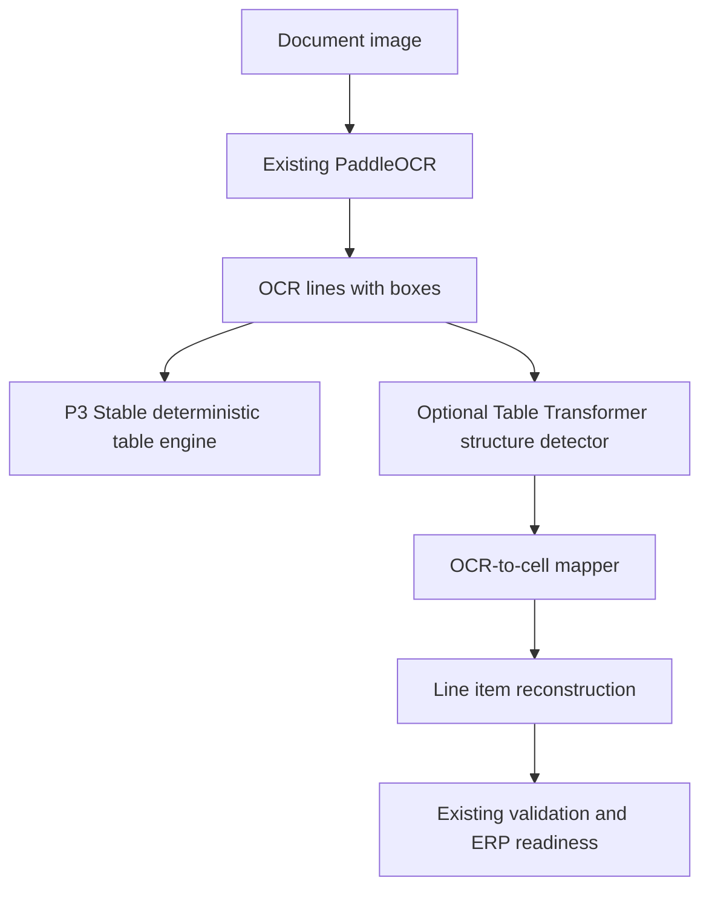

# Microsoft Table Transformer Experimental Architecture

The deterministic P3 Stable table engine remains the production default. The
Table Transformer integration is an optional structure detector that is disabled
unless `INVOICE_OCR_ENABLE_TABLE_TRANSFORMER=true`.

The experimental detector never performs OCR. It consumes the existing page
image and maps existing OCR lines into detected or inferred cells.
