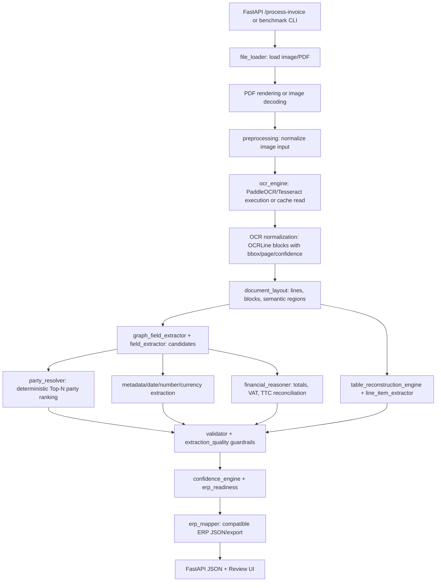

# Smart OCR to ERP Platform - Deterministic v1.0 Architecture

## Status

Deterministic Engine v1.0 freezes the rule-based OCR-to-ERP pipeline as the official baseline before the Hybrid LLM phase. The default profile is stable and reproducible:

- OCR profile: `optimized_mobile_v4`
- Table reconstruction profile: `p3_stable`
- Experimental table profile: `p3_1_adaptive`, available but disabled by default
- Recommended release tag: `v1.0-deterministic`

No OCR, table, party, validation, confidence, or benchmark heuristics should be added after this release unless a new post-v1 phase is opened.

## Complete Pipeline

## Module Responsibilities

- `app/services/file_loader.py`: accepts uploaded documents, supports images and PDFs, and prepares pages for OCR.
- `app/services/preprocessing.py`: applies deterministic preprocessing only. OCR configuration is frozen for v1.
- `app/services/ocr_engine.py`: owns OCR initialization, execution, cache metadata, bbox propagation, and OCR result normalization.
- `app/services/document_layout.py`: groups OCR blocks into lines/regions and exposes logical layout information.
- `app/services/semantic_classifier.py`: classifies document regions and rejects unsafe semantic candidates.
- `app/services/field_extractor.py`: collects candidates for invoice metadata, parties, totals, taxes, currency, and line items.
- `app/services/party_resolver.py`: frozen deterministic company ranking engine with transparent score breakdowns.
- `app/services/table_reconstruction_engine.py`: frozen deterministic table reconstruction engine.
- `app/services/line_item_extractor.py`: selects stable table results and keeps the experimental adaptive profile isolated.
- `app/services/financial_reasoner.py`: reconciles HT, TVA/VAT, TTC, discounts, stamp duty, and payable totals.
- `app/services/validator.py`, `app/services/extraction_quality.py`: block unsafe ERP export and explain review reasons.
- `app/services/confidence_engine.py`: separates OCR, extraction, validation, business, and ERP confidence.
- `app/services/erp_readiness.py`: decides whether export is ready, needs review, or blocked.
- `scripts/benchmark_multi_datasets.py`, `scripts/large_benchmark_runner.py`: reproducible multi-dataset benchmarking.
- `scripts/dataset_label_adapter.py`, `scripts/table_ground_truth_adapter.py`: benchmark-only ground-truth normalization.

## OCR Pipeline

The v1 OCR baseline uses `optimized_mobile_v4`, backed by PaddleOCR mobile detection/recognition models when available. Tesseract remains a fallback path, but OCR settings are frozen for deterministic v1. OCR results must preserve text, confidence, page number, bbox, page dimensions, and coordinate space when the OCR engine provides geometry.

## Extraction Pipeline

Extraction is candidate-based. The system collects multiple candidates per field, attaches evidence, computes confidence, and then chooses the best candidate under validation guardrails. Existing API compatibility is preserved: legacy `detected_fields`, `erp_json`, and `erp_export` remain available while richer debug structures expose candidates, layout, table diagnostics, and party rankings.

## Validation Pipeline

Validation prevents unsafe ERP export. Missing required fields, inconsistent totals, suspicious parties, rejected candidates, invalid line items, and low-confidence states force `needs_review` or `invalid`. The platform favors review over false certainty.

## Benchmark Methodology

The benchmark samples multiple external datasets deterministically with a fixed seed. It separates:

- completeness: whether a field was found;
- strict accuracy: raw or normalized exact match;
- canonical accuracy: fair comparison after ground-truth normalization;
- validation readiness: whether the ERP export is safe;
- performance: cached/fresh OCR timing and error rates.

Primary v1 benchmark run:

- Run ID: `v1_deterministic_50doc_01`
- Documents: 50
- Seed: 42
- OCR profile: `optimized_mobile_v4`
- Table profile: `p3_stable`
- Configuration hash: `9699262229f6b19dc0ab0f5ad813adc79aa9a777c693ccb183ff46e6a4640f32`

## Benchmark Datasets

The benchmark includes samples from:

- `FATURA2-invoices`
- `high-quality-invoice-images-for-ocr`
- `invoiceXpert`
- `invoices-and-receipts_ocr_v1`
- `invoices-donut-data-v1`
- `md_invoices`

## Final Stable Metrics

| Metric | v1 deterministic result |
| --- | ---: |
| Invoice number normalized accuracy | 100% |
| Invoice date normalized accuracy | 100% |
| Amount TTC normalized accuracy | 76.92% |
| Supplier canonical accuracy | 70% |
| Customer canonical accuracy | 100% |
| Canonical line-item presence | 60% |
| Canonical exact row count | 52% |
| Canonical row count within ±1 | 68% |

The table metrics are frozen as the stable deterministic baseline. The final diagnostics did not justify a safe rule-only change capable of reaching the stretch target without increasing false positives, so the stable behavior was preserved.

## Supported Languages

The deterministic pipeline includes support for common French and English invoice labels. Arabic labels are partially supported through keyword and OCR text handling, with full Arabic robustness left for the Hybrid LLM phase.

## Supported Document Types

- invoices
- delivery notes
- receipts
- purchase/order-like business documents
- scanned images and PDFs

## Design Decisions

- Keep OCR frozen to preserve reproducibility.
- Keep `p3_stable` as the default table profile.
- Keep `p3_1_adaptive` available but disabled.
- Prefer safe ERP blocking over optimistic export.
- Use canonical benchmark comparison where dataset labels include address or metadata in party fields.
- Store diagnostics for every major extraction decision.

## Known Limitations

- Tables with no reliable header, severe OCR fragmentation, or non-tabular visual structure may still need review.
- Some datasets provide weak or zero-item labels, so table metrics must be interpreted with the ground-truth adapter notes.
- ERP readiness remains conservative; many documents are intentionally blocked when financial or line-item consistency is uncertain.
- Arabic extraction is not yet at the same maturity as French/English.
- Fresh OCR performance depends on local CPU and installed OCR models.

## Extension Points

The next phase should add Hybrid LLM reasoning after deterministic extraction, not replace the deterministic baseline. Suggested extension points:

- LLM-assisted table row recovery for unresolved fragments.
- LLM-assisted party disambiguation when deterministic Top-N candidates are close.
- LLM-assisted validation explanation and correction suggestions.
- Human correction memory feeding candidate scores.

## Freeze Statement

Deterministic v1.0 is frozen as the baseline. Future improvements should be tracked under a new Hybrid LLM phase or a new deterministic v1.x maintenance scope.
